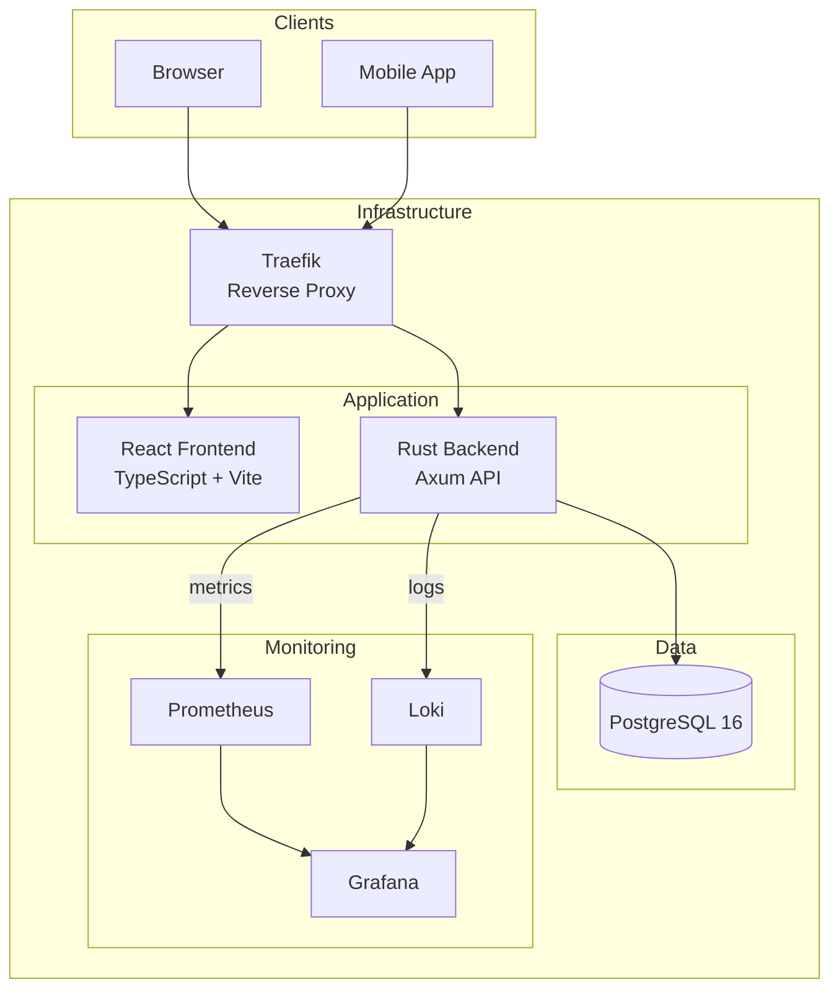

# Time Manager - Documentation

> Documentation technique complète de la plateforme SaaS de gestion du temps de travail

---

## Navigation rapide

| Section | Description |
|---------|-------------|
| [Getting Started](./getting-started/) | Installation et premier lancement |
| [API Reference](./api/) | Swagger OpenAPI + guides |
| [Architecture](./architecture/) | Diagrammes et structure technique |
| [Features](./features/) | Flux fonctionnels (auth, clock, absences) |
| [Security](./security/) | JWT, RBAC, protections |
| [DevOps](./devops/) | CI/CD, monitoring, Docker |
| [Appendices](./appendices/) | Glossaire, FAQ, changelog |

---

## Vue d'ensemble



---

## Stack technique

| Couche | Technologies |
|--------|--------------|
| **Backend** | Rust 1.80+, Axum 0.7, Diesel ORM, PostgreSQL 16 |
| **Frontend** | React 18, TypeScript 5, Vite 5, Tailwind CSS, Zustand |
| **Auth** | JWT (RS256), Argon2id, HIBP integration |
| **Infrastructure** | Docker, Traefik v2, Prometheus, Loki, Grafana |

---

## Fonctionnalités principales

| Feature | Description | Doc |
|---------|-------------|-----|
| **Authentification** | JWT + refresh tokens, sessions, invitations | [→ Auth Flow](./features/auth-flow.md) |
| **Pointage** | Clock in/out, approbations, restrictions | [→ Clock](./features/clock-management.md) |
| **Absences** | Demandes, types, soldes, workflow | [→ Absences](./features/absence-management.md) |
| **RBAC** | 4 rôles hiérarchiques | [→ RBAC](./features/rbac.md) |
| **KPIs** | Dashboards, analytics | [→ KPIs](./features/kpis.md) |
| **Multi-tenant** | Isolation par organisation | [→ Architecture](./architecture/) |

---

## Démarrage rapide

```bash
# 1. Cloner le repo
git clone <repository-url>
cd time-manager

# 2. Configurer l'environnement
cp .env.dev.example .env

# 3. Lancer
docker compose up -d

# 4. Accéder à l'app
open http://localhost:8000
```

**Comptes de test** : voir [Getting Started](./getting-started/quickstart.md)

---

## API

- **Base URL** : `http://localhost:8000/api/v1`
- **Auth** : Bearer token JWT
- **Format** : JSON
- **Swagger** : [openapi.yaml](./api/openapi.yaml)

→ [Documentation API complète](./api/)

---

## Liens utiles

| Ressource | URL |
|-----------|-----|
| Application | http://localhost:8000 |
| Traefik Dashboard | http://localhost:8081 |
| Grafana | http://localhost:3001 |
| Mailpit (dev) | http://localhost:8025 |
| pgAdmin | http://localhost:5050 |

---

## Structure du projet

```
time-manager/
├── backend/           # API Rust/Axum
│   ├── src/
│   │   ├── api/      # Handlers HTTP
│   │   ├── services/ # Logique métier
│   │   └── repositories/
│   └── migrations/   # SQL Diesel
├── frontend/          # React/TypeScript
│   └── src/
│       ├── components/
│       ├── pages/
│       └── stores/
├── infrastructure/    # Configs monitoring
└── docs/             # Cette documentation
```

---

## Contribution

1. Créer une branche feature
2. Développer avec tests
3. PR vers `master`
4. Review + CI verte
5. Merge

→ Voir [Branch Protection](./devops/branch-protection.md)
