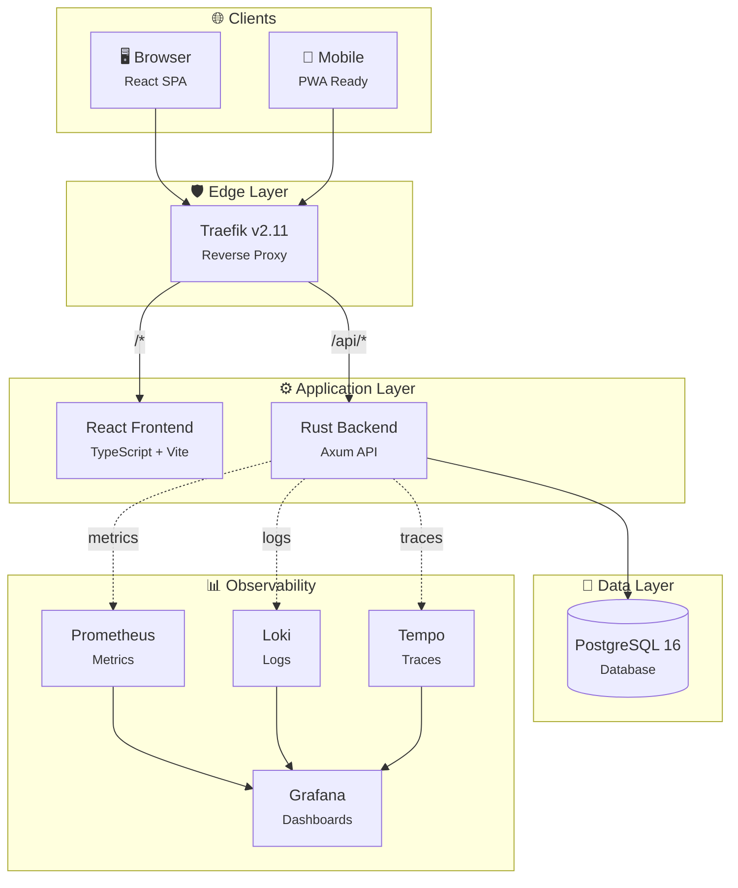
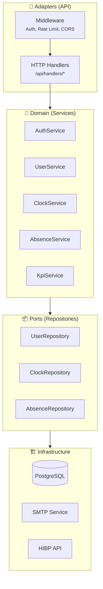
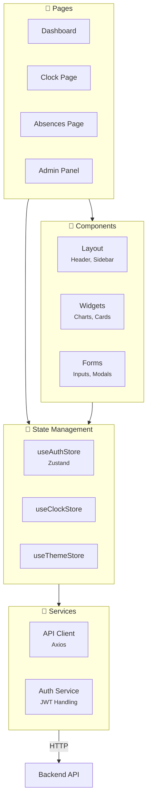
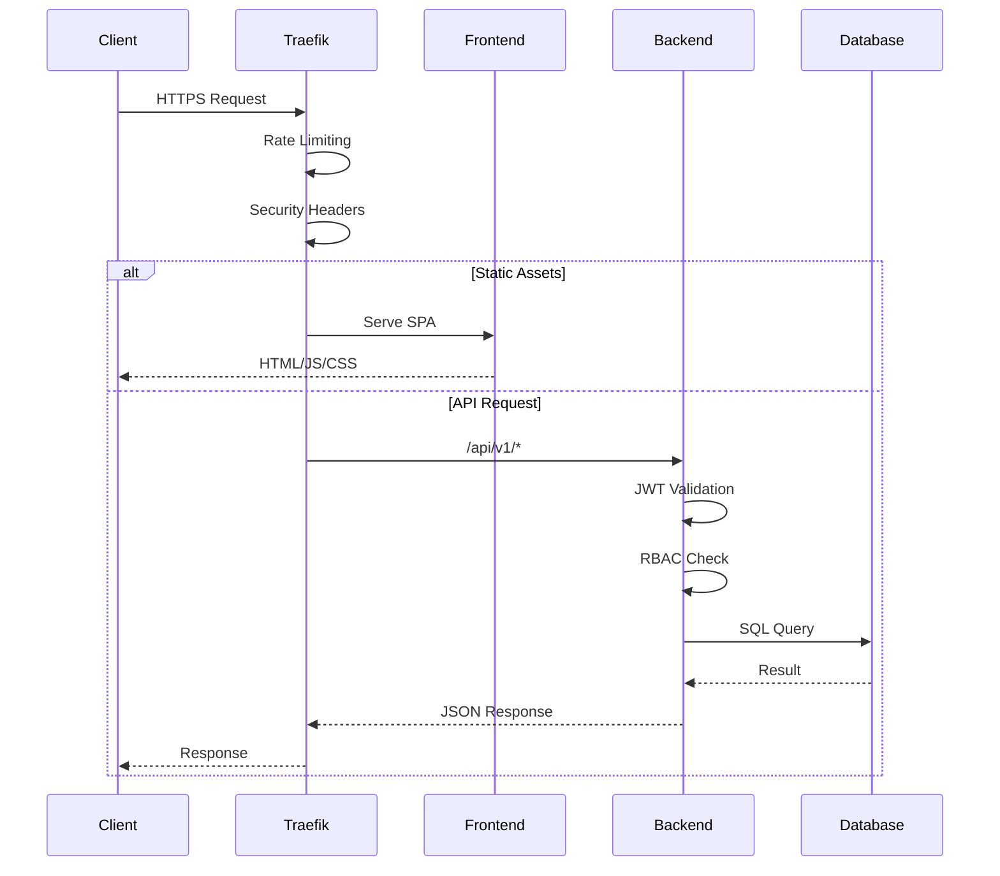
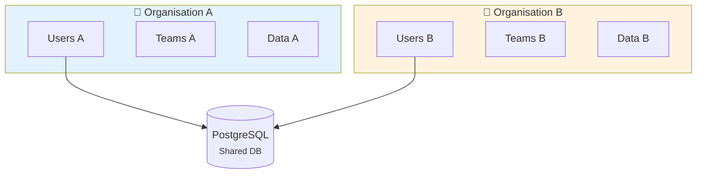
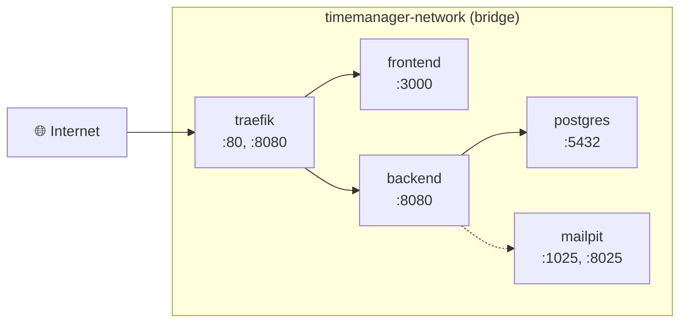

# Architecture

> Vue d'ensemble technique de l'architecture Time Manager

---

## Vue globale



---

## Stack technique

| Couche | Technologies | Version |
|--------|-------------|---------|
| **Frontend** | React, TypeScript, Vite, Tailwind CSS, Zustand | 18.x, 5.x, 5.x |
| **Backend** | Rust, Axum, Diesel ORM | 1.80+, 0.7, 2.x |
| **Database** | PostgreSQL | 16-alpine |
| **Proxy** | Traefik | v2.11 |
| **Monitoring** | Prometheus, Loki, Tempo, Grafana | latest |

---

## Architecture Backend

### Hexagonal Architecture



### Structure des dossiers Backend

```
backend/src/
├── api/
│   ├── handlers/      # HTTP request handlers (17 modules)
│   │   ├── auth/      # Authentication endpoints
│   │   ├── users/     # User management
│   │   ├── clocks/    # Clock in/out
│   │   ├── absences/  # Leave management
│   │   └── ...
│   └── router.rs      # Route definitions
├── services/          # Business logic layer
├── repositories/      # Data access layer
├── models/            # Domain models & DTOs
├── middleware/        # Auth, metrics, rate limiting
├── config/            # App configuration
└── utils/             # Helpers (JWT, password, etc.)
```

---

## Architecture Frontend

### Component Architecture



### Structure des dossiers Frontend

```
frontend/src/
├── pages/             # Route pages
├── components/        # Reusable UI components
│   ├── ui/           # Base components (Radix UI)
│   └── ...           # Feature components
├── stores/           # Zustand state stores
├── services/         # API services
├── hooks/            # Custom React hooks
├── lib/              # Utilities
└── types/            # TypeScript types
```

---

## Flux de données

### Request Flow



---

## Multi-tenancy

### Isolation par Organisation



**Caractéristiques :**
- Isolation logique via `organization_id` sur chaque table
- Un utilisateur appartient à une seule organisation
- Les Super Admins peuvent gérer plusieurs organisations

---

## Communication inter-services

### Docker Network



---

## Scalabilité

### Points d'extension

| Composant | Stratégie | Notes |
|-----------|-----------|-------|
| **Backend** | Horizontal scaling | Stateless, load balancé via Traefik |
| **Database** | Read replicas | PostgreSQL streaming replication |
| **Cache** | Redis (future) | Session cache, rate limiting |
| **Files** | S3 (future) | Documents, exports |

---

## Liens connexes

- [Backend détaillé](./backend.md)
- [Frontend détaillé](./frontend.md)
- [Base de données](./database.md)
- [Infrastructure](./infrastructure.md)
