# Architecture

> Vue d'ensemble technique de l'architecture Time Manager

---

## Vue globale

```mermaid
graph TB
    subgraph Clients["🌐 Clients"]
        Browser["🖥️ Browser<br/><small>React SPA</small>"]
        Mobile["📱 Mobile<br/><small>PWA Ready</small>"]
    end

    subgraph Edge["🛡️ Edge Layer"]
        Traefik["Traefik v2.11<br/><small>Reverse Proxy</small>"]
    end

    subgraph Application["⚙️ Application Layer"]
        Frontend["React Frontend<br/><small>TypeScript + Vite</small>"]
        Backend["Rust Backend<br/><small>Axum API</small>"]
    end

    subgraph Data["💾 Data Layer"]
        PostgreSQL[("PostgreSQL 16<br/><small>Database</small>")]
    end

    subgraph Observability["📊 Observability"]
        Prometheus["Prometheus<br/><small>Metrics</small>"]
        Loki["Loki<br/><small>Logs</small>"]
        Tempo["Tempo<br/><small>Traces</small>"]
        Grafana["Grafana<br/><small>Dashboards</small>"]
    end

    Browser --> Traefik
    Mobile --> Traefik
    Traefik -->|"/api/*"| Backend
    Traefik -->|"/*"| Frontend
    Backend --> PostgreSQL
    Backend -.->|metrics| Prometheus
    Backend -.->|logs| Loki
    Backend -.->|traces| Tempo
    Prometheus --> Grafana
    Loki --> Grafana
    Tempo --> Grafana
```



---

## Stack technique

| Couche | Technologies | Version |
|--------|-------------|---------|
| **Frontend** | React, TypeScript, Vite, Tailwind CSS, Zustand | 18.x, 5.x, 5.x |
| **Backend** | Rust, Axum, Diesel ORM | 1.80+, 0.7, 2.x |
| **Database** | PostgreSQL | 16-alpine |
| **Proxy** | Traefik | v2.11 |
| **Monitoring** | Prometheus, Loki, Tempo, Grafana | latest |

---

## Architecture Backend

### Hexagonal Architecture

```mermaid
graph TB
    subgraph Adapters["🔌 Adapters (API)"]
        HTTP["HTTP Handlers<br/><small>/api/handlers/*</small>"]
        Middleware["Middleware<br/><small>Auth, Rate Limit, CORS</small>"]
    end

    subgraph Core["🎯 Domain (Services)"]
        AuthService["AuthService"]
        UserService["UserService"]
        ClockService["ClockService"]
        AbsenceService["AbsenceService"]
        KpiService["KpiService"]
    end

    subgraph Ports["📦 Ports (Repositories)"]
        UserRepo["UserRepository"]
        ClockRepo["ClockRepository"]
        AbsenceRepo["AbsenceRepository"]
    end

    subgraph Infra["🏗️ Infrastructure"]
        DB[("PostgreSQL")]
        Email["SMTP Service"]
        HIBP["HIBP API"]
    end

    HTTP --> Core
    Middleware --> HTTP
    Core --> Ports
    Ports --> Infra
```



### Structure des dossiers Backend

```
backend/src/
├── api/
│   ├── handlers/      # HTTP request handlers (17 modules)
│   │   ├── auth/      # Authentication endpoints
│   │   ├── users/     # User management
│   │   ├── clocks/    # Clock in/out
│   │   ├── absences/  # Leave management
│   │   └── ...
│   └── router.rs      # Route definitions
├── services/          # Business logic layer
├── repositories/      # Data access layer
├── models/            # Domain models & DTOs
├── middleware/        # Auth, metrics, rate limiting
├── config/            # App configuration
└── utils/             # Helpers (JWT, password, etc.)
```

---

## Architecture Frontend

### Component Architecture

```mermaid
graph TB
    subgraph Pages["📄 Pages"]
        Dashboard["Dashboard"]
        Clock["Clock Page"]
        Absences["Absences Page"]
        Admin["Admin Panel"]
    end

    subgraph Components["🧩 Components"]
        Layout["Layout<br/><small>Header, Sidebar</small>"]
        Widgets["Widgets<br/><small>Charts, Cards</small>"]
        Forms["Forms<br/><small>Inputs, Modals</small>"]
    end

    subgraph State["🔄 State Management"]
        AuthStore["useAuthStore<br/><small>Zustand</small>"]
        ClockStore["useClockStore"]
        ThemeStore["useThemeStore"]
    end

    subgraph Services["🔌 Services"]
        API["API Client<br/><small>Axios</small>"]
        Auth["Auth Service<br/><small>JWT Handling</small>"]
    end

    Pages --> Components
    Pages --> State
    Components --> State
    State --> Services
    Services -->|HTTP| Backend["Backend API"]
```



### Structure des dossiers Frontend

```
frontend/src/
├── pages/             # Route pages
├── components/        # Reusable UI components
│   ├── ui/           # Base components (Radix UI)
│   └── ...           # Feature components
├── stores/           # Zustand state stores
├── services/         # API services
├── hooks/            # Custom React hooks
├── lib/              # Utilities
└── types/            # TypeScript types
```

---

## Flux de données

### Request Flow


---

## Multi-tenancy

### Isolation par Organisation

```mermaid
graph TB
    subgraph Org1["🏢 Organisation A"]
        U1["Users A"]
        T1["Teams A"]
        D1["Data A"]
    end

    subgraph Org2["🏢 Organisation B"]
        U2["Users B"]
        T2["Teams B"]
        D2["Data B"]
    end

    DB[("PostgreSQL<br/><small>Shared DB</small>")]

    U1 --> DB
    U2 --> DB

    style Org1 fill:#e3f2fd
    style Org2 fill:#fff3e0
```



**Caractéristiques :**
- Isolation logique via `organization_id` sur chaque table
- Un utilisateur appartient à une seule organisation
- Les Super Admins peuvent gérer plusieurs organisations

---

## Communication inter-services

### Docker Network

```mermaid
graph LR
    subgraph Network["timemanager-network (bridge)"]
        T["traefik<br/>:80, :8080"]
        F["frontend<br/>:3000"]
        B["backend<br/>:8080"]
        P["postgres<br/>:5432"]
        M["mailpit<br/>:1025, :8025"]
    end

    Internet["🌐 Internet"] --> T
    T --> F
    T --> B
    B --> P
    B -.-> M
```



---

## Scalabilité

### Points d'extension

| Composant | Stratégie | Notes |
|-----------|-----------|-------|
| **Backend** | Horizontal scaling | Stateless, load balancé via Traefik |
| **Database** | Read replicas | PostgreSQL streaming replication |
| **Cache** | Redis (future) | Session cache, rate limiting |
| **Files** | S3 (future) | Documents, exports |

---

## Liens connexes

- [Backend détaillé](./backend.md)
- [Frontend détaillé](./frontend.md)
- [Base de données](./database.md)
- [Infrastructure](./infrastructure.md)
