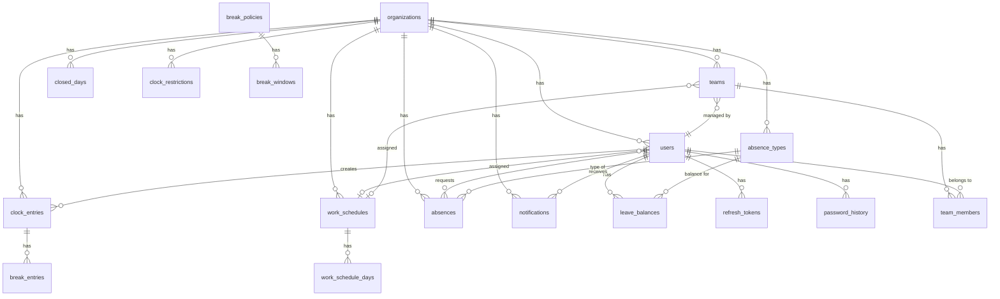
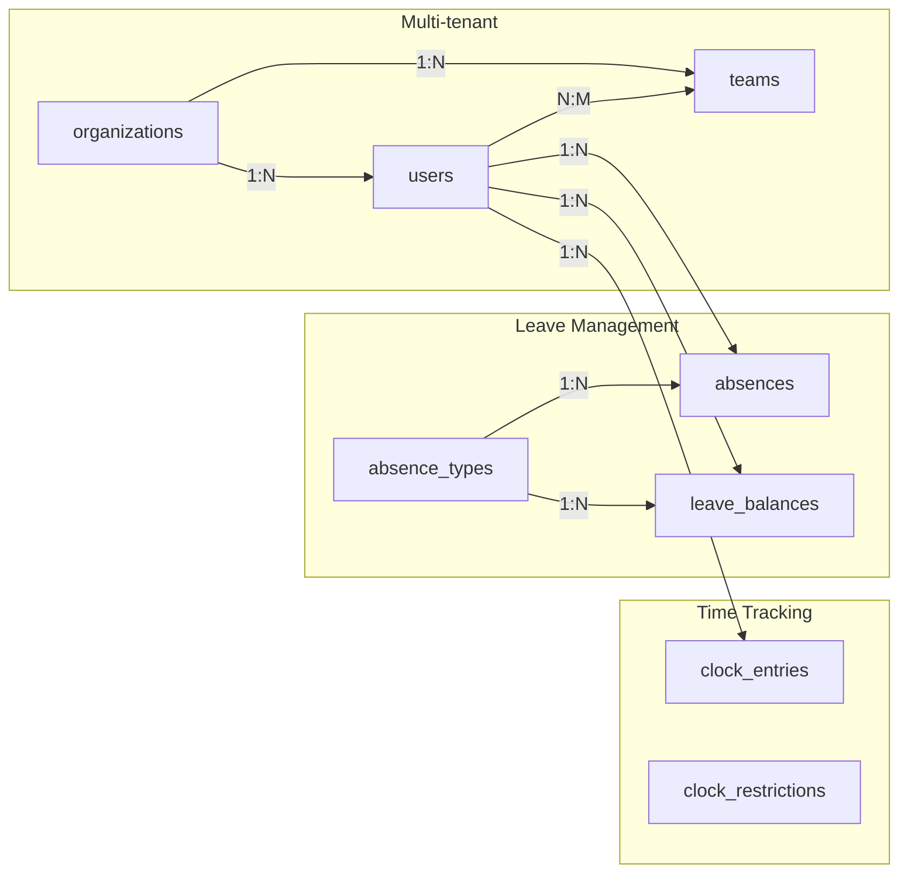

# Database Schema

> Schéma PostgreSQL de Time Manager

---

## Vue d'ensemble



---

## Tables principales

### organizations

Table racine pour le multi-tenant.

| Colonne | Type | Description |
|---------|------|-------------|
| `id` | UUID | PK |
| `name` | VARCHAR(255) | Nom de l'organisation |
| `slug` | VARCHAR(255) | Identifiant unique (URL) |
| `timezone` | VARCHAR(100) | Fuseau horaire (défaut: UTC) |
| `created_at` | TIMESTAMP | Date création |
| `updated_at` | TIMESTAMP | Dernière modification |

---

### users

Utilisateurs de la plateforme.

| Colonne | Type | Description |
|---------|------|-------------|
| `id` | UUID | PK |
| `organization_id` | UUID | FK → organizations |
| `email` | VARCHAR(255) | Email unique |
| `password_hash` | VARCHAR(255) | Hash Argon2id |
| `first_name` | VARCHAR(100) | Prénom |
| `last_name` | VARCHAR(100) | Nom |
| `phone` | VARCHAR(20) | Téléphone (optionnel) |
| `role` | user_role | `super_admin`, `admin`, `manager`, `employee` |
| `work_schedule_id` | UUID | FK → work_schedules (optionnel) |
| `failed_login_attempts` | INT | Compteur brute force |
| `locked_until` | TIMESTAMP | Verrouillage compte |
| `password_changed_at` | TIMESTAMP | Dernier changement MDP |
| `deleted_at` | TIMESTAMP | Soft delete |
| `created_at` | TIMESTAMP | Date création |
| `updated_at` | TIMESTAMP | Dernière modification |

**Index :** `email`, `organization_id`, `role`

---

### teams

Équipes au sein d'une organisation.

| Colonne | Type | Description |
|---------|------|-------------|
| `id` | UUID | PK |
| `organization_id` | UUID | FK → organizations |
| `name` | VARCHAR(100) | Nom équipe (unique par org) |
| `description` | TEXT | Description |
| `manager_id` | UUID | FK → users (manager) |
| `work_schedule_id` | UUID | FK → work_schedules |
| `created_at` | TIMESTAMPTZ | Date création |
| `updated_at` | TIMESTAMPTZ | Dernière modification |

---

### team_members

Association N:N users ↔ teams.

| Colonne | Type | Description |
|---------|------|-------------|
| `id` | UUID | PK |
| `team_id` | UUID | FK → teams |
| `user_id` | UUID | FK → users |
| `joined_at` | TIMESTAMPTZ | Date d'ajout |

**Contrainte :** UNIQUE(team_id, user_id)

---

## Pointage

### clock_entries

Entrées de pointage.

| Colonne | Type | Description |
|---------|------|-------------|
| `id` | UUID | PK |
| `organization_id` | UUID | FK → organizations |
| `user_id` | UUID | FK → users |
| `clock_in` | TIMESTAMPTZ | Heure d'arrivée |
| `clock_out` | TIMESTAMPTZ | Heure de départ (NULL si actif) |
| `status` | clock_entry_status | `pending`, `approved`, `rejected` |
| `approved_by` | UUID | FK → users (manager) |
| `approved_at` | TIMESTAMPTZ | Date approbation |
| `notes` | TEXT | Notes |
| `created_at` | TIMESTAMPTZ | Date création |
| `updated_at` | TIMESTAMPTZ | Dernière modification |

**Index :** `user_id`, `clock_in`, `status`, index partiel sur entrées ouvertes

---

### clock_restrictions

Restrictions de pointage (horaires autorisés).

| Colonne | Type | Description |
|---------|------|-------------|
| `id` | UUID | PK |
| `organization_id` | UUID | FK → organizations |
| `team_id` | UUID | FK → teams (optionnel) |
| `user_id` | UUID | FK → users (optionnel) |
| `mode` | clock_restriction_mode | `strict`, `flexible`, `unrestricted` |
| `clock_in_earliest` | TIME | Heure min clock in |
| `clock_in_latest` | TIME | Heure max clock in |
| `clock_out_earliest` | TIME | Heure min clock out |
| `clock_out_latest` | TIME | Heure max clock out |
| `enforce_schedule` | BOOLEAN | Respecter le planning |
| `require_manager_approval` | BOOLEAN | Approbation pour override |
| `is_active` | BOOLEAN | Restriction active |

**Hiérarchie :** User > Team > Organization

---

### clock_override_requests

Demandes de dérogation aux restrictions.

| Colonne | Type | Description |
|---------|------|-------------|
| `id` | UUID | PK |
| `organization_id` | UUID | FK → organizations |
| `user_id` | UUID | FK → users |
| `clock_entry_id` | UUID | FK → clock_entries |
| `requested_action` | VARCHAR(10) | `clock_in` ou `clock_out` |
| `requested_at` | TIMESTAMPTZ | Heure demandée |
| `reason` | TEXT | Justification |
| `status` | clock_override_status | `pending`, `approved`, `rejected`, `auto_approved` |
| `reviewed_by` | UUID | FK → users |
| `reviewed_at` | TIMESTAMPTZ | Date review |
| `review_notes` | TEXT | Notes manager |

---

## Absences

### absence_types

Types d'absence configurables.

| Colonne | Type | Description |
|---------|------|-------------|
| `id` | UUID | PK |
| `organization_id` | UUID | FK → organizations |
| `name` | VARCHAR(100) | Nom (ex: "Congés payés") |
| `code` | VARCHAR(20) | Code (ex: "CP") |
| `color` | VARCHAR(7) | Couleur hex |
| `requires_approval` | BOOLEAN | Nécessite approbation |
| `affects_balance` | BOOLEAN | Déduit du solde |
| `is_paid` | BOOLEAN | Absence rémunérée |

---

### absences

Demandes d'absence.

| Colonne | Type | Description |
|---------|------|-------------|
| `id` | UUID | PK |
| `organization_id` | UUID | FK → organizations |
| `user_id` | UUID | FK → users |
| `type_id` | UUID | FK → absence_types |
| `start_date` | DATE | Date début |
| `end_date` | DATE | Date fin |
| `days_count` | DECIMAL(4,1) | Nombre de jours |
| `status` | absence_status | `pending`, `approved`, `rejected`, `cancelled` |
| `reason` | TEXT | Motif |
| `rejection_reason` | TEXT | Raison du refus |
| `approved_by` | UUID | FK → users |
| `approved_at` | TIMESTAMPTZ | Date approbation |

**Contraintes :** `end_date >= start_date`, `days_count > 0`

---

### leave_balances

Soldes de congés par utilisateur/type/année.

| Colonne | Type | Description |
|---------|------|-------------|
| `id` | UUID | PK |
| `organization_id` | UUID | FK → organizations |
| `user_id` | UUID | FK → users |
| `absence_type_id` | UUID | FK → absence_types |
| `year` | INT | Année |
| `initial_balance` | DECIMAL(4,1) | Solde initial |
| `used` | DECIMAL(4,1) | Jours utilisés |
| `adjustment` | DECIMAL(4,1) | Ajustements |

**Calcul :** `remaining = initial_balance + adjustment - used`

---

## Plannings

### work_schedules

Définitions de plannings.

| Colonne | Type | Description |
|---------|------|-------------|
| `id` | UUID | PK |
| `organization_id` | UUID | FK → organizations |
| `name` | VARCHAR(100) | Nom du planning |
| `description` | TEXT | Description |
| `is_default` | BOOLEAN | Planning par défaut |

---

### work_schedule_days

Jours de travail d'un planning.

| Colonne | Type | Description |
|---------|------|-------------|
| `id` | UUID | PK |
| `work_schedule_id` | UUID | FK → work_schedules |
| `day_of_week` | SMALLINT | 0 (Dim) à 6 (Sam) |
| `start_time` | TIME | Heure début |
| `end_time` | TIME | Heure fin |
| `break_minutes` | INT | Minutes de pause |

---

### closed_days

Jours fériés / fermetures.

| Colonne | Type | Description |
|---------|------|-------------|
| `id` | UUID | PK |
| `organization_id` | UUID | FK → organizations |
| `date` | DATE | Date du jour fermé |
| `name` | VARCHAR(100) | Nom (ex: "Noël") |
| `description` | TEXT | Description |

---

## Authentification

### refresh_tokens

Tokens de rafraîchissement JWT.

| Colonne | Type | Description |
|---------|------|-------------|
| `id` | UUID | PK |
| `user_id` | UUID | FK → users |
| `token_hash` | VARCHAR(255) | Hash du token |
| `expires_at` | TIMESTAMPTZ | Expiration |
| `user_agent` | VARCHAR(500) | Browser/device |
| `ip_address` | VARCHAR(45) | IP client |
| `last_used_at` | TIMESTAMPTZ | Dernière utilisation |
| `created_at` | TIMESTAMPTZ | Date création |

---

### password_history

Historique des mots de passe (5 derniers).

| Colonne | Type | Description |
|---------|------|-------------|
| `id` | UUID | PK |
| `user_id` | UUID | FK → users |
| `password_hash` | VARCHAR(255) | Hash ancien MDP |
| `created_at` | TIMESTAMPTZ | Date création |

---

### invite_tokens

Invitations utilisateur.

| Colonne | Type | Description |
|---------|------|-------------|
| `id` | UUID | PK |
| `user_id` | UUID | FK → users |
| `token_hash` | VARCHAR(255) | Hash du token |
| `expires_at` | TIMESTAMPTZ | Expiration |
| `created_at` | TIMESTAMPTZ | Date création |

---

### password_reset_tokens

Tokens de réinitialisation MDP.

| Colonne | Type | Description |
|---------|------|-------------|
| `id` | UUID | PK |
| `user_id` | UUID | FK → users |
| `token_hash` | VARCHAR(255) | Hash du token |
| `expires_at` | TIMESTAMPTZ | Expiration (6h) |
| `created_at` | TIMESTAMPTZ | Date création |

---

## Autres

### notifications

Notifications utilisateur.

| Colonne | Type | Description |
|---------|------|-------------|
| `id` | UUID | PK |
| `organization_id` | UUID | FK → organizations |
| `user_id` | UUID | FK → users |
| `type` | notification_type | Type de notification |
| `title` | VARCHAR(255) | Titre |
| `message` | TEXT | Contenu |
| `data` | JSONB | Données additionnelles |
| `read_at` | TIMESTAMPTZ | Date de lecture |
| `created_at` | TIMESTAMPTZ | Date création |

**Types :** `absence_approved`, `absence_rejected`, `absence_pending`, `clock_correction`, `clock_approved`, `clock_rejected`

---

### audit_logs

Journal d'audit des actions sensibles.

| Colonne | Type | Description |
|---------|------|-------------|
| `id` | UUID | PK |
| `organization_id` | UUID | FK → organizations |
| `user_id` | UUID | FK → users (acteur) |
| `action` | VARCHAR(100) | Action effectuée |
| `entity_type` | VARCHAR(50) | Type d'entité |
| `entity_id` | UUID | ID de l'entité |
| `old_values` | JSONB | Valeurs avant |
| `new_values` | JSONB | Valeurs après |
| `ip_address` | VARCHAR(45) | IP client |
| `user_agent` | VARCHAR(500) | Browser/device |
| `created_at` | TIMESTAMPTZ | Date création |

---

## Enums

```sql
-- Rôles utilisateur
CREATE TYPE user_role AS ENUM (
    'super_admin',
    'admin',
    'manager',
    'employee'
);

-- Statut pointage
CREATE TYPE clock_entry_status AS ENUM (
    'pending',
    'approved',
    'rejected'
);

-- Statut absence
CREATE TYPE absence_status AS ENUM (
    'pending',
    'approved',
    'rejected',
    'cancelled'
);

-- Mode restriction
CREATE TYPE clock_restriction_mode AS ENUM (
    'strict',
    'flexible',
    'unrestricted'
);

-- Statut override
CREATE TYPE clock_override_status AS ENUM (
    'pending',
    'approved',
    'rejected',
    'auto_approved'
);

-- Type notification
CREATE TYPE notification_type AS ENUM (
    'absence_approved',
    'absence_rejected',
    'absence_pending',
    'clock_correction',
    'clock_approved',
    'clock_rejected'
);
```

---

## Relations clés



---

## Migrations

Les migrations sont gérées par **Diesel ORM** dans `backend/migrations/`.

```bash
# Créer une migration
diesel migration generate nom_migration

# Appliquer les migrations
diesel migration run

# Rollback
diesel migration revert
```

---

## Liens connexes

- [Architecture](./README.md)
- [Backend](./backend.md)
