# DevOps

> CI/CD, monitoring et infrastructure de Time Manager

---

## Vue d'ensemble

```mermaid
graph LR
    subgraph Dev["💻 Development"]
        Code["Code"]
        PR["Pull Request"]
    end

    subgraph CI["🔄 CI Pipeline"]
        Lint["Lint"]
        Test["Test"]
        Build["Build"]
    end

    subgraph CD["🚀 CD Pipeline"]
        Image["Docker Image"]
        Deploy["Deploy"]
    end

    subgraph Prod["🏭 Production"]
        Server["Hetzner"]
        Monitor["Monitoring"]
    end

    Code --> PR
    PR --> Lint
    Lint --> Test
    Test --> Build
    Build --> Image
    Image --> Deploy
    Deploy --> Server
    Server --> Monitor
```



---

## Documentation

| Document | Description |
|----------|-------------|
| [CI Pipeline](./ci-pipeline.md) | Tests, lint, coverage |
| [CD Pipeline](./cd-pipeline.md) | Build, deploy, rollback |
| [Monitoring](./monitoring.md) | Prometheus, Grafana, Loki |
| [Branch Protection](./branch-protection.md) | Git flow, règles PR |
| [Docker](./docker.md) | Images, compose, volumes |

---

## Quick Reference

### Commandes Docker

```bash
# Développement
docker compose --profile dev up -d

# Avec monitoring
docker compose --profile dev --profile monitoring up -d

# Logs
docker compose logs -f backend

# Restart
docker compose restart backend

# Clean
docker compose down -v
```

### URLs locales

| Service | URL |
|---------|-----|
| App | http://localhost:8000 |
| Traefik | http://localhost:8081 |
| Grafana | http://localhost:3001 |
| Mailpit | http://localhost:8025 |
| pgAdmin | http://localhost:5050 |

---

## Architecture CI/CD


