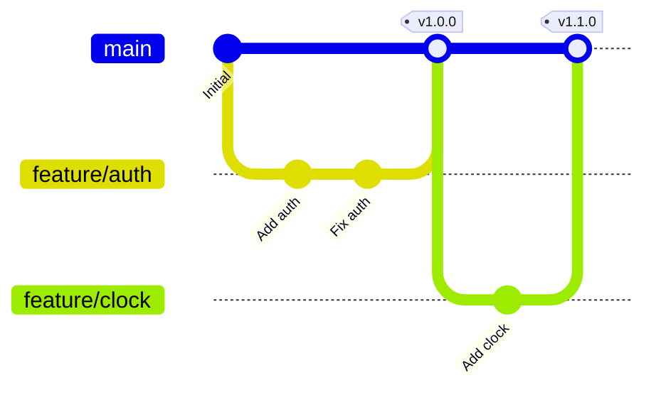
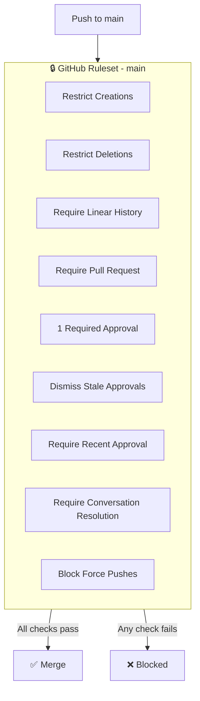
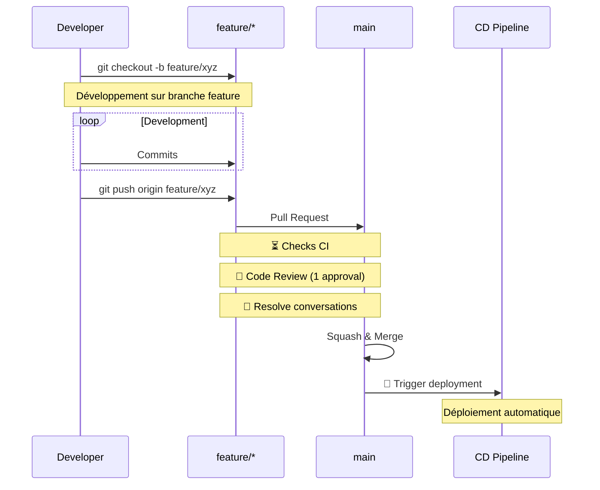
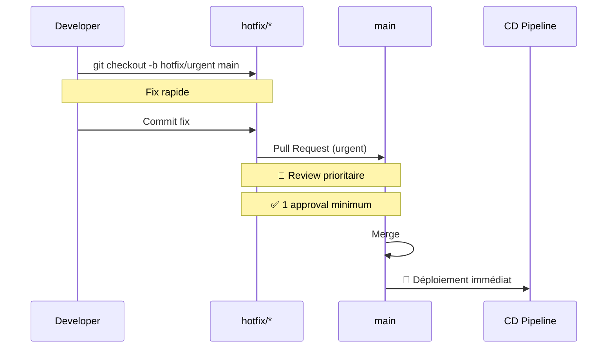
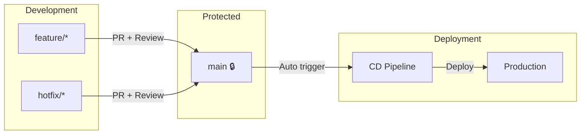

# Branch Protection

> Git flow simplifié et règles de protection via GitHub Rulesets

---

## Vue d'ensemble



### Structure des branches

| Branche | Protection | Usage | CD |
|---------|------------|-------|-----|
| `main` | 🔒 GitHub Ruleset | Production | ✅ Déploiement auto |
| `feature/*` | ❌ Aucune | Développement | ❌ |
| `hotfix/*` | ❌ Aucune | Corrections urgentes | ❌ |

> **Note** : Seule la branche `main` est protégée. Elle sert à la fois de branche principale et de déclencheur du CD.

---

## GitHub Ruleset - Main

### Configuration complète



### Règles détaillées

| Règle | Description | Impact |
|-------|-------------|--------|
| **Restrict creations** | Seuls les utilisateurs avec bypass peuvent créer des refs | Empêche création directe |
| **Restrict deletions** | Seuls les utilisateurs avec bypass peuvent supprimer | Protection contre suppression |
| **Require linear history** | Pas de merge commits | Historique propre et linéaire |
| **Require pull request** | Tous les commits doivent passer par PR | Pas de push direct |
| **1 Required approval** | Au moins 1 approbation requise | Code review obligatoire |
| **Dismiss stale approvals** | Les approbations sont révoquées si nouveaux commits | Re-review nécessaire |
| **Require recent approval** | La personne qui push ne peut pas approuver | Garantit un second regard |
| **Conversation resolution** | Toutes les conversations doivent être résolues | Pas de commentaires ignorés |
| **Block force pushes** | Force push interdit | Préserve l'historique |

### Configuration YAML équivalente

```yaml
ruleset:
  name: main-protection
  target: branch
  enforcement: active

  conditions:
    ref_name:
      include:
        - refs/heads/main

  rules:
    # Restrictions de base
    - type: restrict_creations
      enabled: true

    - type: restrict_deletions
      enabled: true

    - type: non_fast_forward
      enabled: true  # Block force pushes

    # Historique linéaire
    - type: require_linear_history
      enabled: true

    # Pull Request obligatoire
    - type: pull_request
      parameters:
        required_approving_review_count: 1
        dismiss_stale_reviews_on_push: true
        require_code_owner_review: false
        require_last_push_approval: true
        required_review_thread_resolution: true
```

---

## Workflow

### Feature Development



### Hotfix



---

## Pourquoi ce modèle ?

### Avantages

| Aspect | Bénéfice |
|--------|----------|
| **Simplicité** | Pas de branche develop à maintenir |
| **Déploiement rapide** | Merge = déploiement automatique |
| **Historique propre** | Linear history + squash merge |
| **Qualité garantie** | PR obligatoire + approval + conversation resolution |
| **Sécurité** | Force push bloqué + recent approval |

### Flow simplifié



---

## Conventions de commits

### Format

```
<type>(<scope>): <description>

[optional body]

[optional footer]
```

### Types

| Type | Description | Exemple |
|------|-------------|---------|
| `feat` | Nouvelle fonctionnalité | `feat(auth): add password reset` |
| `fix` | Correction de bug | `fix(clock): fix timezone handling` |
| `docs` | Documentation | `docs: update API reference` |
| `style` | Formatage | `style: format with prettier` |
| `refactor` | Refactoring | `refactor(api): extract handlers` |
| `test` | Tests | `test(auth): add login tests` |
| `chore` | Maintenance | `chore: update dependencies` |
| `ci` | CI/CD | `ci: add coverage report` |

### Scopes courants

```
auth, users, teams, clocks, absences,
api, frontend, backend, ci, cd, docs
```

---

## Pull Requests

### Template

```markdown
## Description
<!-- Décrivez vos changements -->

## Type de changement
- [ ] Bug fix
- [ ] New feature
- [ ] Breaking change
- [ ] Documentation

## Checklist
- [ ] Tests ajoutés/mis à jour
- [ ] Documentation mise à jour
- [ ] CI passe
- [ ] Conversations résolues

## Screenshots (si applicable)
```

### Labels

| Label | Description | Couleur |
|-------|-------------|---------|
| `bug` | Bug fix | 🔴 Red |
| `feature` | New feature | 🟢 Green |
| `docs` | Documentation | 🔵 Blue |
| `breaking` | Breaking change | 🟣 Purple |
| `wip` | Work in progress | 🟡 Yellow |
| `needs-review` | Review needed | 🟠 Orange |
| `hotfix` | Correction urgente | 🔴 Red |

---

## Checks CI requis

### Pour merge dans main

| Check | Obligatoire | Description |
|-------|-------------|-------------|
| `backend-fmt` | ✅ | Formatage Rust |
| `backend-clippy` | ✅ | Linting Rust |
| `backend-test` | ✅ | Tests unitaires backend |
| `frontend-lint` | ✅ | ESLint + TypeScript |
| `frontend-unit` | ✅ | Tests Vitest |
| **1 approval** | ✅ | Code review |
| **Conversations** | ✅ | Toutes résolues |

---

## Commandes utiles

```bash
# Créer feature branch depuis main
git checkout main
git pull origin main
git checkout -b feature/my-feature

# Sync avec main
git fetch origin
git rebase origin/main

# Squash commits avant PR
git rebase -i HEAD~3

# Hotfix urgent
git checkout main
git pull origin main
git checkout -b hotfix/urgent-fix

# Après merge, supprimer branche locale
git branch -d feature/my-feature
```

---

## FAQ

### Pourquoi pas de branche develop ?

Le modèle trunk-based simplifié avec une seule branche protégée :
- Réduit la complexité
- Accélère les déploiements
- Évite les conflits de merge entre develop et main
- Chaque PR vers main déclenche directement le CD

### Comment gérer les releases ?

Avec GitHub Releases et tags :
```bash
# Après merge, créer un tag
git tag -a v1.2.0 -m "Release 1.2.0"
git push origin v1.2.0
```

### Que faire si un check CI échoue ?

1. Corriger le problème localement
2. Pusher les corrections
3. Les stale approvals seront révoquées
4. Demander une nouvelle review

---

## Liens connexes

- [CI Pipeline](./ci-pipeline.md)
- [CD Pipeline](./cd-pipeline.md)
- [Monitoring](./monitoring.md)
