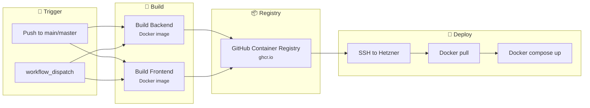
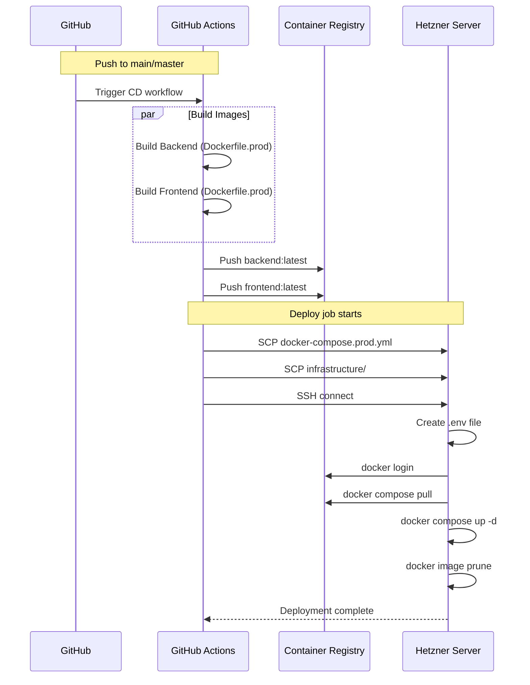
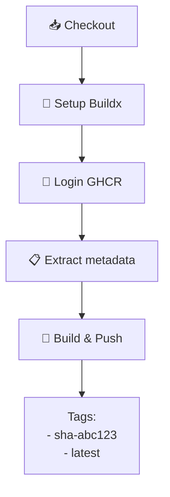
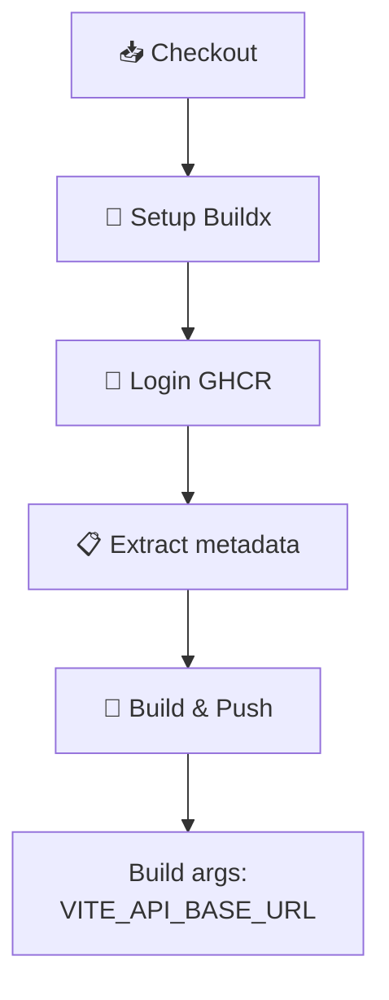
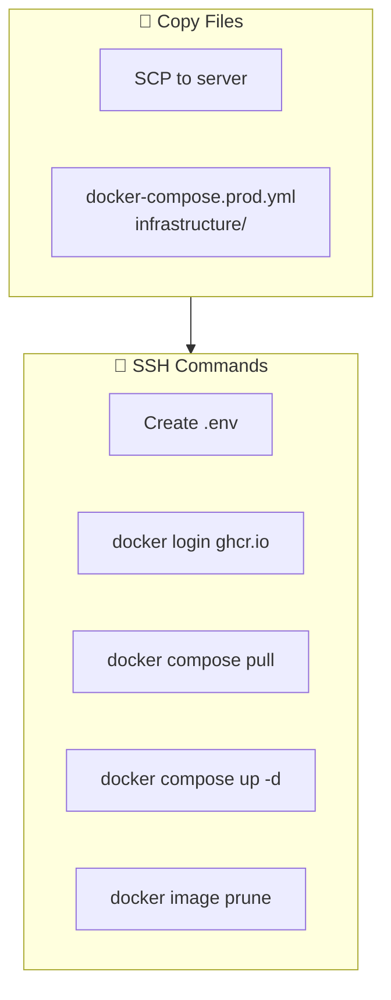
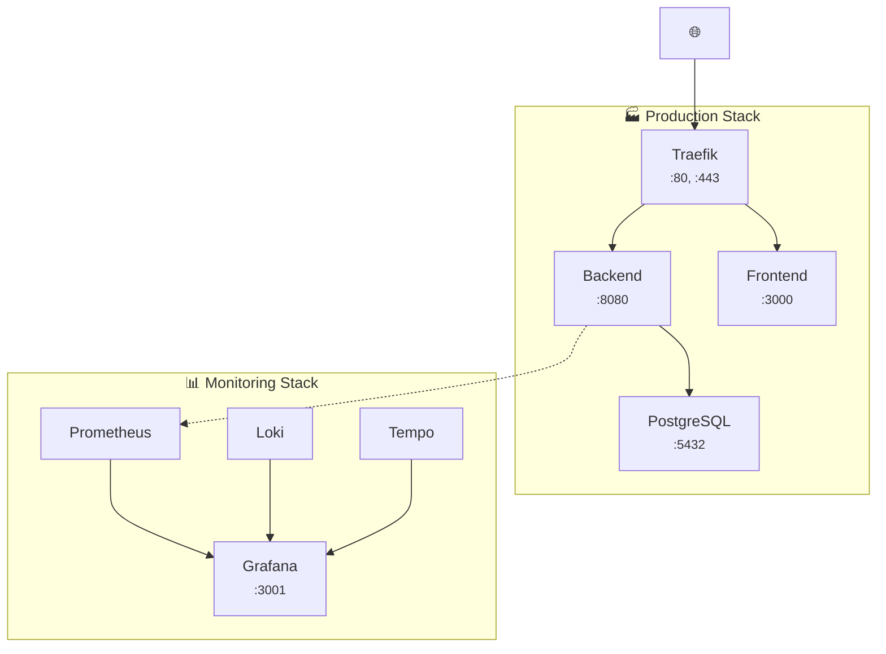

# CD Pipeline

> Déploiement continu vers Hetzner avec GitHub Actions

---

## Vue d'ensemble



---

## Pipeline détaillé



---

## Jobs

### Build Backend



**Détails :**
- Context : `./backend`
- Dockerfile : `Dockerfile.prod`
- Cache : GitHub Actions cache (`type=gha`)
- Tags : SHA commit + `latest`

### Build Frontend



**Build arg :**
```yaml
VITE_API_BASE_URL: https://time-manager.app/api
```

### Deploy



---

## Configuration Production

### Variables d'environnement

| Variable | Source | Description |
|----------|--------|-------------|
| `DOMAIN` | Hardcoded | time-manager.app |
| `POSTGRES_PASSWORD` | Secret | Mot de passe DB |
| `ACME_EMAIL` | Variable | Email Let's Encrypt |
| `SMTP_HOST` | Variable | Serveur SMTP |
| `SMTP_PASSWORD` | Secret | Password SMTP |
| `GRAFANA_PASSWORD` | Secret | Admin Grafana |

### Secrets GitHub

| Secret | Usage |
|--------|-------|
| `HETZNER_HOST` | IP du serveur |
| `HETZNER_SSH_KEY` | Clé SSH privée |
| `GHCR_TOKEN` | Token registry |
| `POSTGRES_PASSWORD` | Password PostgreSQL |
| `SMTP_PASSWORD` | Password SMTP |
| `GRAFANA_PASSWORD` | Password Grafana |

---

## Docker Images

### Tags générés

```
ghcr.io/yassine-el-gherrabi/time-manager/backend:latest
ghcr.io/yassine-el-gherrabi/time-manager/backend:abc123f

ghcr.io/yassine-el-gherrabi/time-manager/frontend:latest
ghcr.io/yassine-el-gherrabi/time-manager/frontend:abc123f
```

### Cache Docker

```yaml
cache-from: type=gha
cache-to: type=gha,mode=max
```

**Avantages :**
- Réutilisation des layers entre builds
- Temps de build réduit (~50%)
- Stocké dans GitHub Actions cache

---

## Infrastructure serveur

### Structure sur Hetzner

```
/opt/timemanager/
├── docker-compose.prod.yml
├── .env
└── infrastructure/
    ├── traefik/
    │   ├── traefik.yml
    │   └── dynamic.yml
    ├── prometheus/
    │   └── prometheus.yml
    ├── grafana/
    │   ├── provisioning/
    │   └── dashboards/
    └── ...
```

### Services déployés



---

## Rollback

### Procédure manuelle

```bash
# SSH sur le serveur
ssh root@<HETZNER_HOST>

# Lister les images disponibles
docker images | grep time-manager

# Revenir à une version précédente
docker compose -f docker-compose.prod.yml pull backend:sha-<commit>
docker compose -f docker-compose.prod.yml up -d
```

### Via GitHub Actions

1. Aller sur Actions > CD - Deploy to Hetzner
2. Click "Run workflow"
3. Sélectionner un commit précédent ou tag

---

## Health Checks

### Vérification post-déploiement

```bash
# Status des containers
docker compose -f docker-compose.prod.yml ps

# Logs backend
docker logs timemanager-backend --tail 100

# Health check API
curl https://time-manager.app/api/health
```

### Monitoring automatique

- **Prometheus** : Scrape `/metrics` toutes les 15s
- **Traefik** : Health checks configurés
- **Grafana** : Alertes sur métriques critiques

---

## Troubleshooting

### Erreur de build

```bash
# Vérifier les logs du workflow
gh run view <run-id> --log

# Build localement
docker build -f backend/Dockerfile.prod ./backend
```

### Erreur de déploiement

```bash
# SSH sur le serveur
ssh root@<HETZNER_HOST>

# Voir les logs
docker compose -f docker-compose.prod.yml logs -f

# Restart un service
docker compose -f docker-compose.prod.yml restart backend
```

### Container qui ne démarre pas

```bash
# Voir les events
docker events --filter container=timemanager-backend

# Inspecter le container
docker inspect timemanager-backend

# Logs détaillés
docker logs timemanager-backend --tail 200
```

---

## Liens connexes

- [CI Pipeline](./ci-pipeline.md)
- [Monitoring](./monitoring.md)
- [Infrastructure Docker](./docker.md)
