# CI Pipeline

> Intégration continue avec GitHub Actions

---

## Vue d'ensemble

```mermaid
graph LR
    subgraph Trigger["🎯 Triggers"]
        Push["Push<br/><small>main, develop</small>"]
        PR["Pull Request<br/><small>any branch</small>"]
    end

    subgraph Backend["🦀 Backend Pipeline"]
        BFmt["cargo fmt"]
        BMachete["cargo machete"]
        BClippy["cargo clippy"]
        BTest["cargo test<br/><small>+ coverage</small>"]
        BInteg["Integration tests"]
    end

    subgraph Frontend["⚛️ Frontend Pipeline"]
        FLint["ESLint + TSC"]
        FUnit["Vitest unit"]
        FInteg["Vitest integration"]
    end

    Push --> BFmt
    PR --> BFmt
    Push --> FLint
    PR --> FLint

    BFmt --> BMachete
    BFmt --> BClippy
    BMachete --> BTest
    BClippy --> BTest
    BTest --> BInteg

    FLint --> FUnit
    FLint --> FInteg
```



---

## Pipeline détaillé

### Backend Flow


### Frontend Flow


---

## Jobs GitHub Actions

### Backend Jobs

| Job | Dépendances | Description | Durée ~|
|-----|-------------|-------------|--------|
| `backend-fmt` | - | Vérification formatage | 30s |
| `backend-machete` | fmt | Détection deps inutilisées | 1m |
| `backend-clippy` | fmt | Linting Rust | 3m |
| `backend-test` | clippy | Tests + coverage | 4m |
| `backend-integration` | test | Tests avec Docker | 5m |

### Frontend Jobs

| Job | Dépendances | Description | Durée ~|
|-----|-------------|-------------|--------|
| `frontend-lint` | - | ESLint + TypeScript | 1m |
| `frontend-unit` | lint | Tests unitaires | 2m |
| `frontend-integration` | lint | Tests intégration | 2m |

---

## Concurrency

```yaml
concurrency:
  group: ci-${{ github.head_ref || github.ref }}
  cancel-in-progress: true
```

**Comportement :**
- Annule les runs précédents sur la même branche
- Évite les runs inutiles lors de push rapides
- Économise les minutes GitHub Actions

---

## Cache Strategy

### Rust (Backend)

```mermaid
graph LR
    subgraph Cache["🗄️ Rust Cache"]
        Cargo["~/.cargo/registry"]
        Target["backend/target"]
    end

    Job1["Job 1"] --> Cache
    Cache --> Job2["Job 2"]
    Cache --> Job3["Job 3"]
```



**Configuration :**
```yaml
- uses: Swatinem/rust-cache@v2
  with:
    workspaces: backend -> target
```

### Node.js (Frontend)

```yaml
- uses: actions/setup-node@v4
  with:
    node-version: '20'
    cache: 'npm'
    cache-dependency-path: frontend/package-lock.json
```

---

## Coverage Reports

### Backend Coverage

```yaml
- name: Run tests with coverage
  run: cargo llvm-cov nextest --no-fail-fast --lcov --output-path lcov.info
```

**Output :** `lcov.info` (format LCOV standard)

### Frontend Coverage

```yaml
- name: Run unit tests with coverage
  run: npm run test:unit -- --coverage
```

---

## Artifacts

### Frontend Build

```yaml
- name: Upload build artifact
  uses: actions/upload-artifact@v4
  with:
    name: frontend-dist
    path: frontend/dist/
    retention-days: 1
```

**Utilisé par :** CD pipeline pour le déploiement

---

## Checks requis

### Protection de branche

Pour merger dans `main`/`develop` :

| Check | Requis | Bloquant |
|-------|--------|----------|
| `backend-fmt` | ✅ | Oui |
| `backend-clippy` | ✅ | Oui |
| `backend-test` | ✅ | Oui |
| `frontend-lint` | ✅ | Oui |
| `frontend-unit` | ✅ | Oui |
| `backend-machete` | ⚠️ | Non |
| Coverage thresholds | ⚠️ | Non |

---

## Outils utilisés

### Backend

| Outil | Version | Usage |
|-------|---------|-------|
| `rustfmt` | stable | Formatage code |
| `clippy` | stable | Linting |
| `cargo-nextest` | latest | Test runner rapide |
| `cargo-llvm-cov` | latest | Coverage LLVM |
| `cargo-machete` | latest | Détection deps |

### Frontend

| Outil | Version | Usage |
|-------|---------|-------|
| `eslint` | 8.x | Linting JS/TS |
| `typescript` | 5.x | Type checking |
| `vitest` | latest | Test runner |
| `@vitest/coverage-v8` | latest | Coverage |

---

## Troubleshooting

### Erreur `cargo fmt`

```bash
# Localement
cd backend
cargo fmt

# Vérifier sans modifier
cargo fmt --check
```

### Erreur `clippy`

```bash
cd backend
cargo clippy --all-targets --all-features -- -D warnings

# Corriger automatiquement
cargo clippy --fix --allow-dirty
```

### Erreur `machete`

```bash
cd backend
cargo machete

# Supprimer dep inutilisée
cargo remove <dependency>
```

### Tests échoués

```bash
# Backend - run tests localement
cd backend
cargo nextest run

# Frontend - run tests localement
cd frontend
npm run test:unit
```

---

## Liens connexes

- [CD Pipeline](./cd-pipeline.md)
- [Branch Protection](./branch-protection.md)
- [Monitoring](./monitoring.md)
