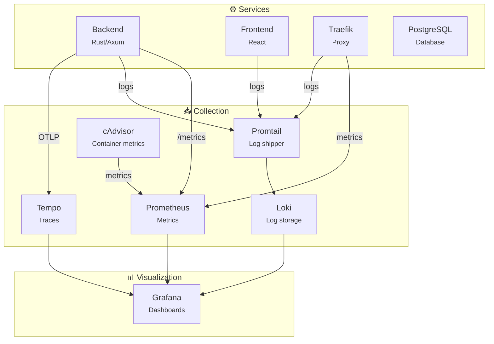
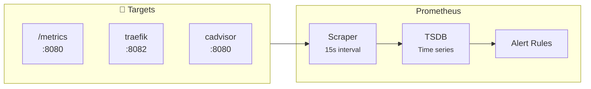
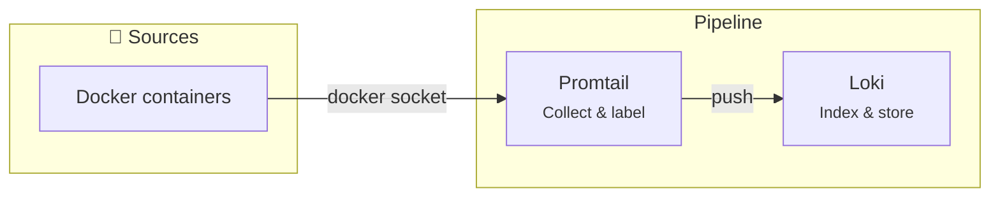
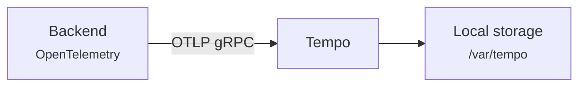
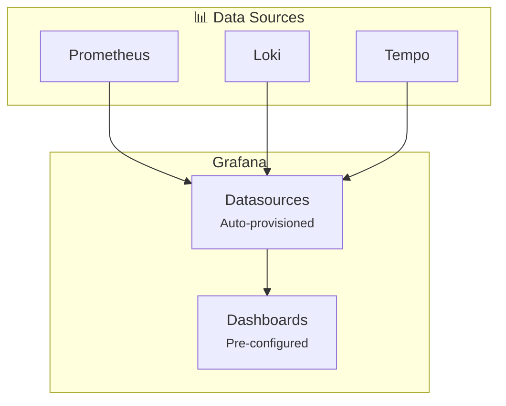
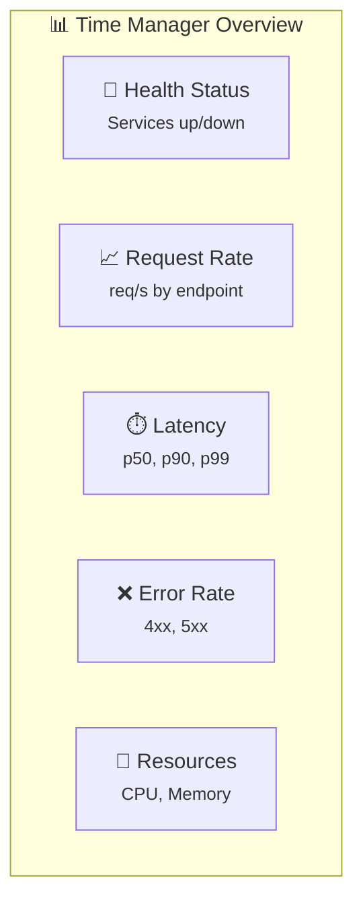
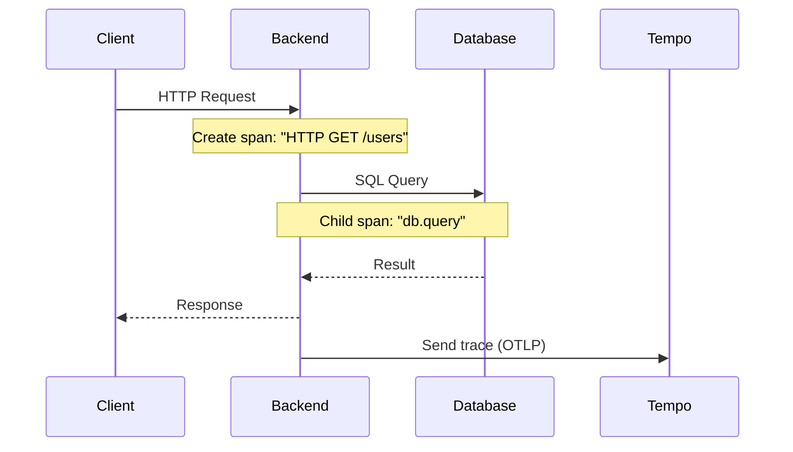

# Monitoring

> Stack d'observabilité avec Prometheus, Loki, Tempo et Grafana

---

## Architecture



---

## Composants

### Prometheus (Métriques)

**Port :** `9090`



**Métriques collectées :**
| Source | Métriques |
|--------|-----------|
| Backend | HTTP requests, latency, errors |
| Traefik | Request count, duration, status |
| cAdvisor | CPU, memory, network, disk per container |

### Loki (Logs)

**Port :** `3100`



**Labels appliqués :**
- `container_name`
- `compose_service`
- `compose_project`

### Tempo (Traces)

**Ports :** `3200` (HTTP), `4317` (OTLP gRPC), `4318` (OTLP HTTP)



**Configuration backend :**
```yaml
OTEL_EXPORTER_OTLP_ENDPOINT: http://tempo:4317
OTEL_SERVICE_NAME: timemanager-backend
```

### Grafana (Dashboards)

**Port :** `3001`



---

## Activation

### Démarrer le monitoring

```bash
# Dev avec monitoring
docker compose --profile dev --profile monitoring up -d

# Prod avec monitoring
docker compose -f docker-compose.prod.yml --profile monitoring up -d
```

### Accès aux interfaces

| Service | URL | Credentials |
|---------|-----|-------------|
| Grafana | http://localhost:3001 | admin / admin |
| Prometheus | http://localhost:9090 | - |
| Traefik | http://localhost:8081 | - |

---

## Dashboards Grafana

### Dashboard Overview



### Panneaux disponibles

| Panneau | Source | Query exemple |
|---------|--------|---------------|
| Request Rate | Prometheus | `rate(http_requests_total[5m])` |
| Latency P99 | Prometheus | `histogram_quantile(0.99, http_request_duration_seconds_bucket)` |
| Error Rate | Prometheus | `rate(http_requests_total{status=~"5.."}[5m])` |
| Container CPU | cAdvisor | `container_cpu_usage_seconds_total` |
| Logs | Loki | `{container_name="timemanager-backend"}` |

---

## Métriques Backend

### Métriques exposées

```rust
// Endpoint: GET /metrics

# TYPE http_requests_total counter
http_requests_total{method="GET",path="/api/v1/auth/me",status="200"} 1234

# TYPE http_request_duration_seconds histogram
http_request_duration_seconds_bucket{le="0.1"} 900
http_request_duration_seconds_bucket{le="0.5"} 1100
http_request_duration_seconds_bucket{le="1.0"} 1200
```

### Types de métriques

| Métrique | Type | Description |
|----------|------|-------------|
| `http_requests_total` | Counter | Total des requêtes |
| `http_request_duration_seconds` | Histogram | Durée des requêtes |
| `db_pool_connections` | Gauge | Connexions DB actives |
| `auth_login_attempts` | Counter | Tentatives de login |

---

## Logs avec Loki

### Requêtes LogQL

```logql
# Logs du backend
{container_name="timemanager-backend"}

# Erreurs uniquement
{container_name="timemanager-backend"} |= "ERROR"

# Requêtes lentes (>1s)
{container_name="timemanager-backend"} | json | duration > 1000

# Logs d'authentification
{container_name="timemanager-backend"} |= "auth"
```

### Labels disponibles

```yaml
container_name: "timemanager-backend"
compose_service: "backend"
compose_project: "time-manager"
```

---

## Traces avec Tempo

### Intégration OpenTelemetry



### Configuration Rust

```toml
# Cargo.toml
[dependencies]
opentelemetry = "0.21"
opentelemetry-otlp = "0.14"
tracing-opentelemetry = "0.22"
```

---

## Alertes

### Règles Prometheus

```yaml
# alerts.yml
groups:
  - name: timemanager
    rules:
      - alert: HighErrorRate
        expr: rate(http_requests_total{status=~"5.."}[5m]) > 0.1
        for: 5m
        labels:
          severity: critical
        annotations:
          summary: "High error rate detected"

      - alert: ServiceDown
        expr: up == 0
        for: 1m
        labels:
          severity: critical
        annotations:
          summary: "Service {{ $labels.job }} is down"
```

### Alertes Grafana

| Alerte | Condition | Sévérité |
|--------|-----------|----------|
| High Error Rate | >10% erreurs 5xx | Critical |
| High Latency | p99 > 2s | Warning |
| Service Down | target unreachable | Critical |
| High Memory | >90% RAM | Warning |

---

## Rétention des données

| Service | Rétention | Stockage |
|---------|-----------|----------|
| Prometheus | 15 jours | `prometheus_data` volume |
| Loki | 7 jours | `loki_data` volume |
| Tempo | 7 jours | `tempo_data` volume |
| Grafana | - | `grafana_data` volume |

---

## Troubleshooting

### Prometheus ne scrappe pas

```bash
# Vérifier les targets
curl http://localhost:9090/api/v1/targets

# Vérifier la config
docker exec timemanager-prometheus cat /etc/prometheus/prometheus.yml
```

### Logs manquants dans Loki

```bash
# Vérifier Promtail
docker logs timemanager-promtail

# Tester la connexion Loki
curl http://localhost:3100/ready
```

### Traces non visibles

```bash
# Vérifier Tempo
curl http://localhost:3200/ready

# Vérifier les env vars backend
docker exec timemanager-backend env | grep OTEL
```

---

## Liens connexes

- [CI Pipeline](./ci-pipeline.md)
- [CD Pipeline](./cd-pipeline.md)
- [Docker Infrastructure](./docker.md)
