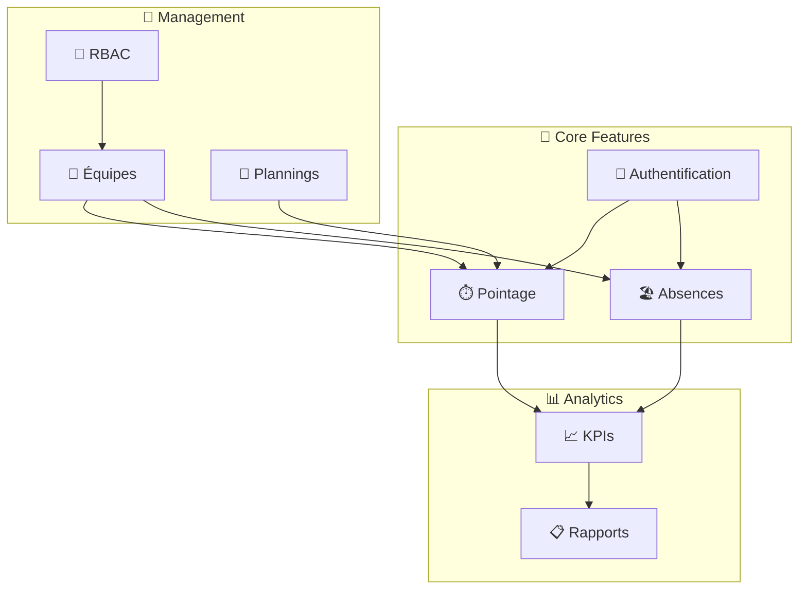
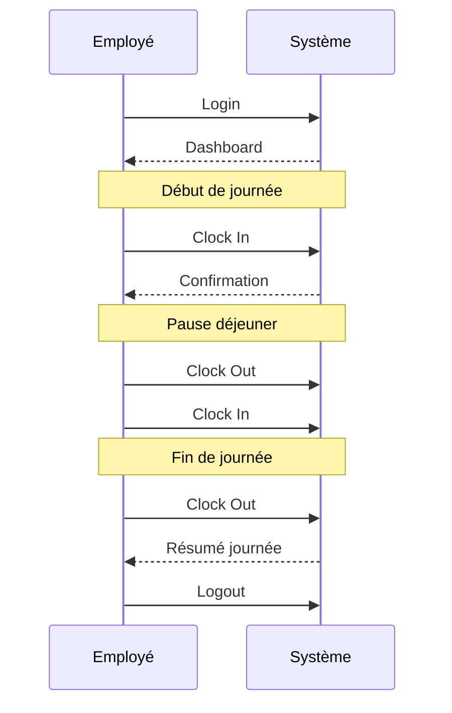
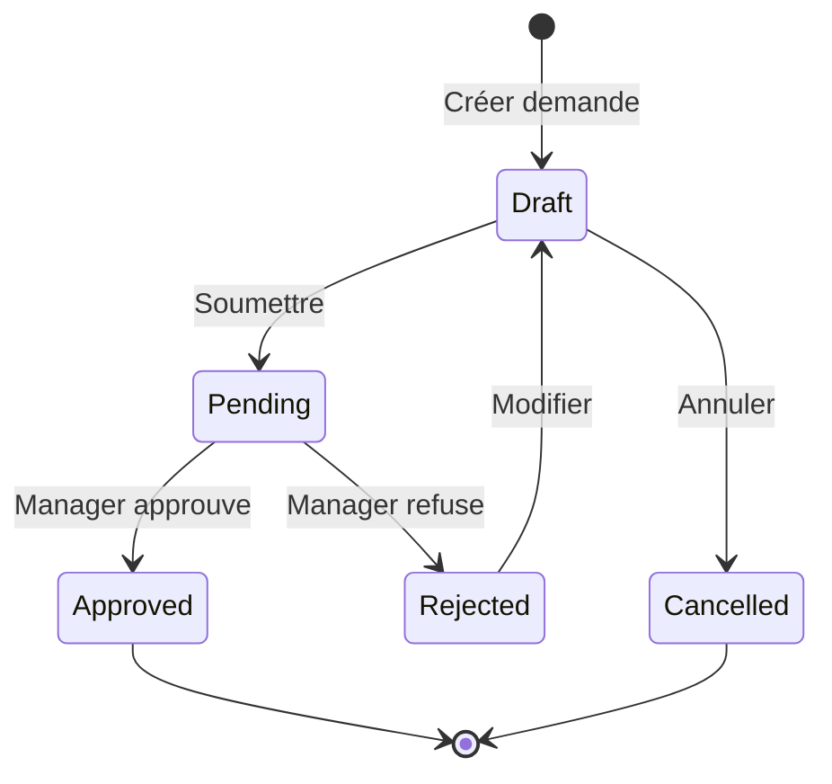

# Fonctionnalités

> Documentation des flux fonctionnels de Time Manager

---

## Vue d'ensemble

---

## Fonctionnalités par rôle

| Fonctionnalité | Employee | Manager | Admin | Super Admin |
|----------------|----------|---------|-------|-------------|
| Clock in/out | ✅ | ✅ | ✅ | ✅ |
| Voir mes KPIs | ✅ | ✅ | ✅ | ✅ |
| Demander absence | ✅ | ✅ | ✅ | ✅ |
| Approuver pointages | ❌ | ✅ | ✅ | ✅ |
| Approuver absences | ❌ | ✅ | ✅ | ✅ |
| Gérer équipes | ❌ | ❌ | ✅ | ✅ |
| Gérer utilisateurs | ❌ | ❌ | ✅ | ✅ |
| Gérer organisations | ❌ | ❌ | ❌ | ✅ |
| Voir audit logs | ❌ | ❌ | ❌ | ✅ |

---

## Documentation détaillée

| Document | Description |
|----------|-------------|
| [Auth Flow](./auth-flow.md) | Authentification, sessions, invitations |
| [RBAC](./rbac.md) | Rôles, permissions, hiérarchie |
| [Clock Management](./clock-management.md) | Pointage, approbations, restrictions |
| [Absence Management](./absence-management.md) | Congés, workflow, soldes |
| [Schedules](./schedules.md) | Plannings de travail |
| [KPIs](./kpis.md) | Indicateurs et analytics |

---

## Flux principaux

### Journée type d'un employé

### Workflow d'absence

---

## Liens connexes

- [API Reference](../api/)
- [Architecture](../architecture/)
