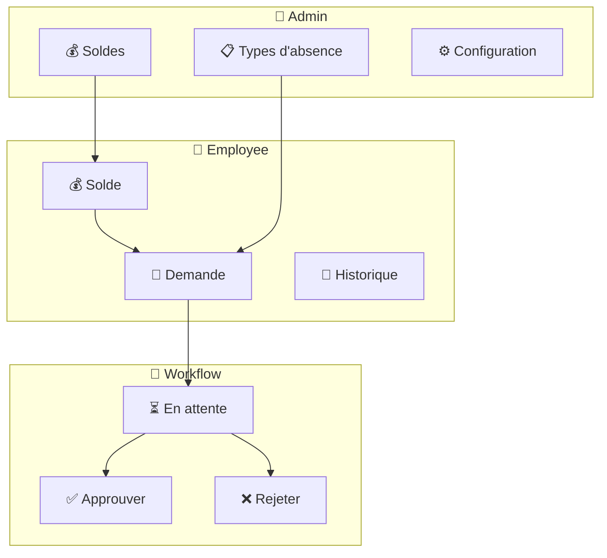
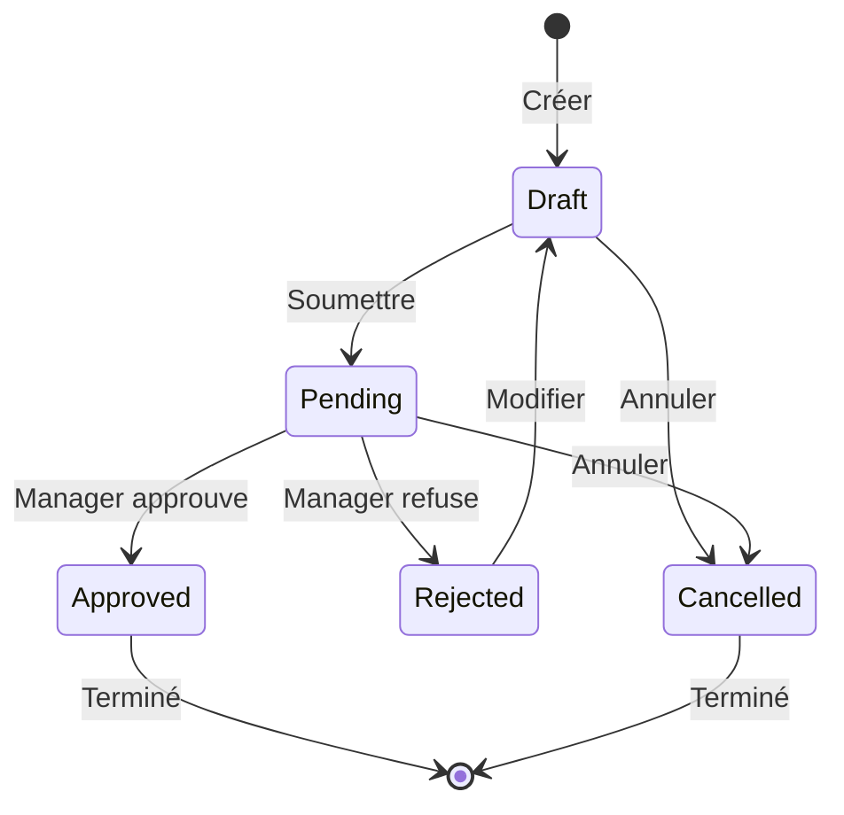
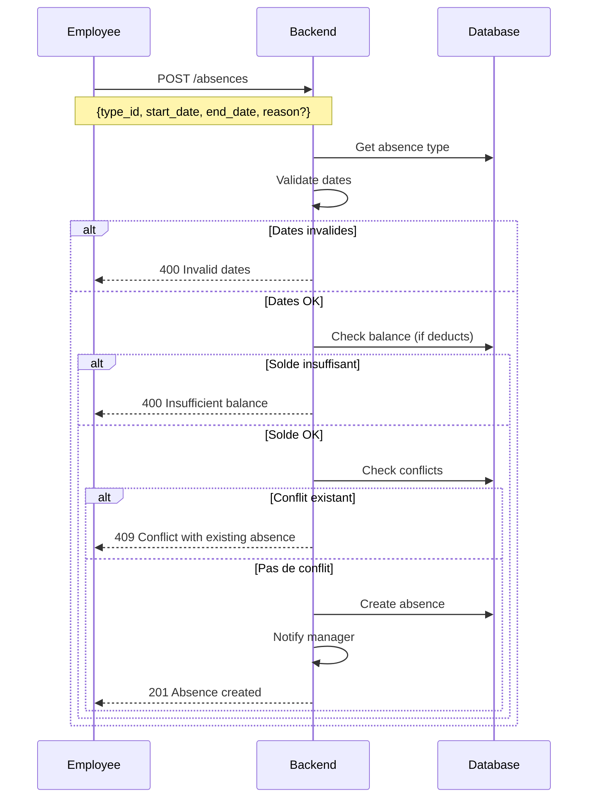
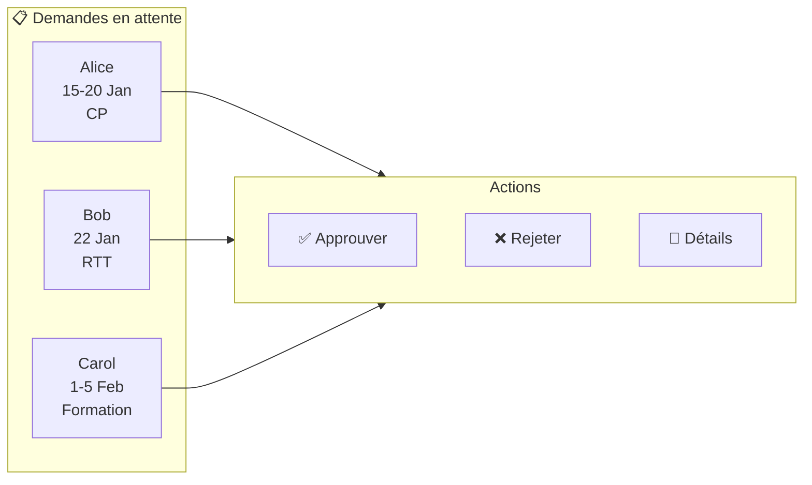
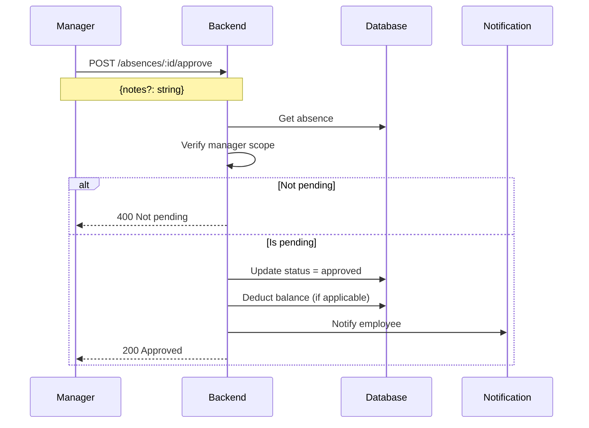
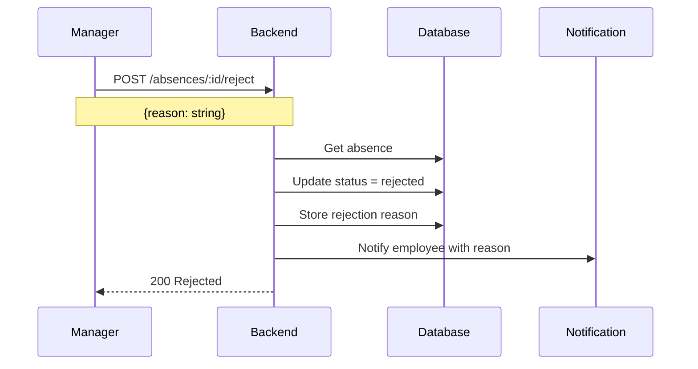
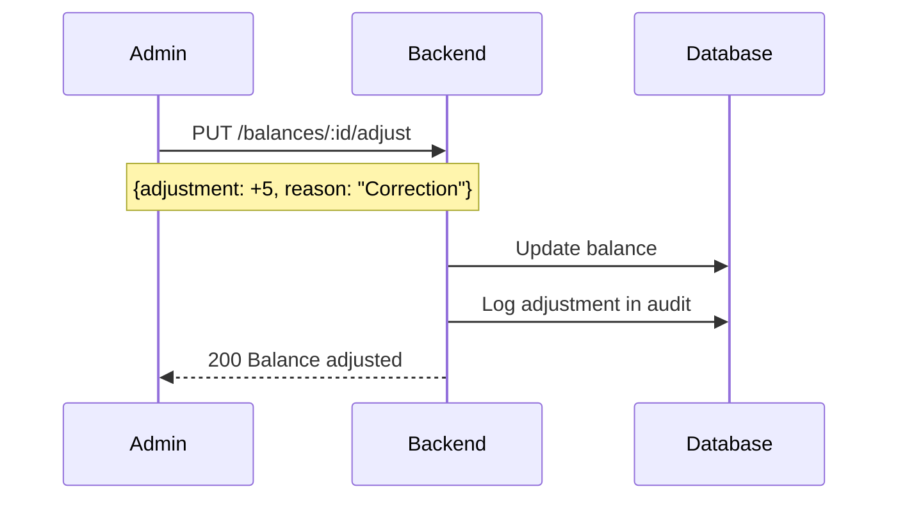
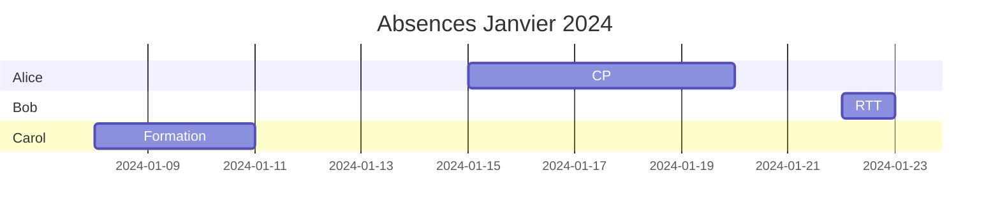

# Absence Management

> Gestion des congés et absences avec workflow d'approbation

---

## Vue d'ensemble



---

## Types d'absence

### Types prédéfinis

| Type | Décompte solde | Approbation requise | Exemple |
|------|----------------|---------------------|---------|
| Congés payés | ✅ | ✅ | Vacances annuelles |
| RTT | ✅ | ✅ | Réduction temps travail |
| Maladie | ❌ | ✅ | Arrêt maladie |
| Maternité/Paternité | ❌ | ✅ | Congé parental |
| Sans solde | ❌ | ✅ | Congé non rémunéré |
| Formation | ❌ | ✅ | Formation professionnelle |
| Événement familial | ❌ | ✅ | Mariage, décès |

### Configuration d'un type

```json
{
  "id": "uuid",
  "organization_id": "uuid",
  "name": "Congés payés",
  "code": "CP",
  "color": "#4CAF50",
  "deducts_balance": true,
  "requires_approval": true,
  "requires_justification": false,
  "max_consecutive_days": 30,
  "min_notice_days": 14,
  "active": true
}
```

---

## Workflow des demandes

### Cycle de vie



### États

| État | Description | Actions possibles |
|------|-------------|-------------------|
| `draft` | Brouillon | Modifier, Soumettre, Annuler |
| `pending` | En attente approbation | Annuler (employee), Approuver/Rejeter (manager) |
| `approved` | Approuvé | - |
| `rejected` | Rejeté | Modifier et re-soumettre |
| `cancelled` | Annulé | - |

---

## Création d'une demande

### Flux



### Validations

| Règle | Description |
|-------|-------------|
| Dates | `start_date` ≤ `end_date` |
| Futur | `start_date` ≥ aujourd'hui |
| Préavis | Respect du `min_notice_days` |
| Durée max | Respect du `max_consecutive_days` |
| Solde | Si `deducts_balance`, solde suffisant |
| Conflits | Pas de chevauchement avec autre absence |

---

## Approbation

### Vue Manager



### Approbation



### Rejet



---

## Gestion des soldes

### Structure

```json
{
  "id": "uuid",
  "user_id": "uuid",
  "absence_type_id": "uuid",
  "year": 2024,
  "initial_balance": 25.0,
  "used": 10.0,
  "pending": 5.0,
  "remaining": 10.0,
  "carry_over": 3.0
}
```

### Calculs

```
remaining = initial_balance + carry_over - used - pending
```

### Ajustements



---

## Calendrier des absences

### Vue équipe



### Conflits détectés

```json
{
  "error": "conflict",
  "message": "Absence conflicts with existing approved absence",
  "conflict": {
    "id": "uuid",
    "type": "Congés payés",
    "dates": "2024-01-15 to 2024-01-20"
  }
}
```

---

## Endpoints

### Employee

| Endpoint | Méthode | Description |
|----------|---------|-------------|
| `/absences` | GET | Lister mes absences |
| `/absences` | POST | Créer une demande |
| `/absences/:id` | GET | Détails d'une absence |
| `/absences/:id/cancel` | POST | Annuler ma demande |
| `/balances/me` | GET | Voir mes soldes |

### Manager

| Endpoint | Méthode | Description |
|----------|---------|-------------|
| `/absences/pending` | GET | Demandes en attente (équipe) |
| `/absences/:id/approve` | POST | Approuver |
| `/absences/:id/reject` | POST | Rejeter |

### Admin

| Endpoint | Méthode | Description |
|----------|---------|-------------|
| `/absence-types` | GET/POST | Gérer les types |
| `/absence-types/:id` | GET/PUT/DELETE | CRUD type |
| `/balances` | GET | Tous les soldes |
| `/balances/:id/adjust` | PUT | Ajuster un solde |

---

## Notifications

### Événements

| Événement | Destinataire | Message |
|-----------|--------------|---------|
| Demande créée | Manager | "Nouvelle demande de {user}" |
| Demande approuvée | Employee | "Votre demande a été approuvée" |
| Demande rejetée | Employee | "Votre demande a été rejetée: {reason}" |
| Demande annulée | Manager | "{user} a annulé sa demande" |
| Solde bas | Employee | "Votre solde de CP est bas: {remaining} jours" |

---

## Rapports

### Métriques

| Métrique | Description |
|----------|-------------|
| Taux d'absence | % jours absence / jours travaillés |
| Jours par type | Répartition par type d'absence |
| Soldes moyens | Moyenne des soldes restants |
| Absences approuvées | Nombre et durée totale |

### Export

```
GET /reports/export?type=absences&from=2024-01-01&to=2024-12-31&format=csv
```

---

## Configuration avancée

### Politiques d'entreprise

```yaml
absence_policies:
  # Report des congés
  carry_over:
    enabled: true
    max_days: 5
    expiry_date: "2024-03-31"

  # Blackout periods
  blackout:
    - start: "2024-12-20"
      end: "2024-12-31"
      reason: "Fermeture annuelle"

  # Approbation automatique
  auto_approve:
    max_days: 2
    types: ["RTT"]
```

---

## Liens connexes

- [RBAC](./rbac.md)
- [Clock Management](./clock-management.md)
- [KPIs](./kpis.md)
