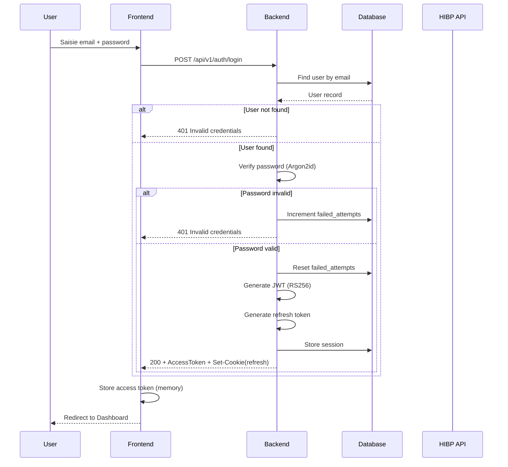
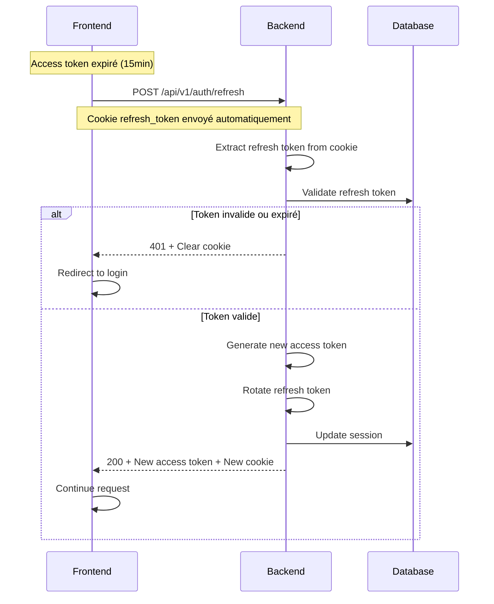
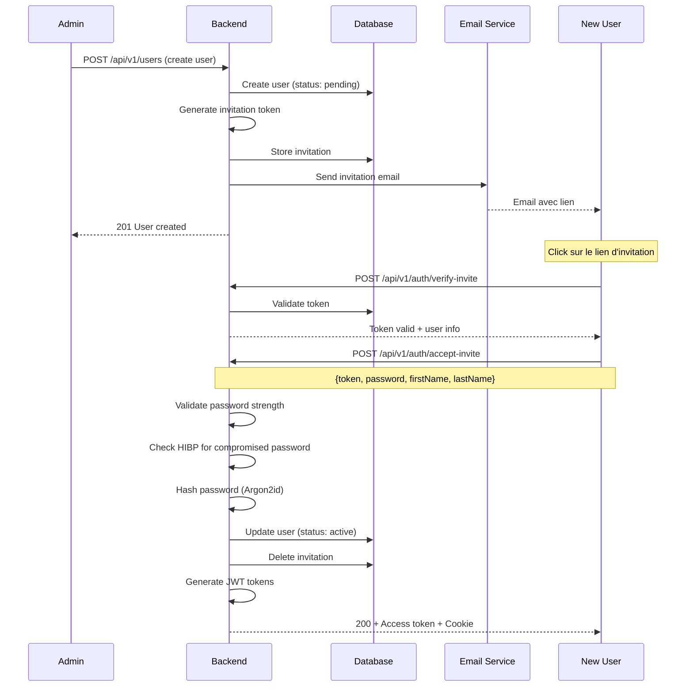
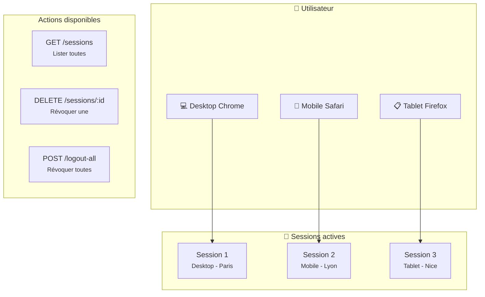
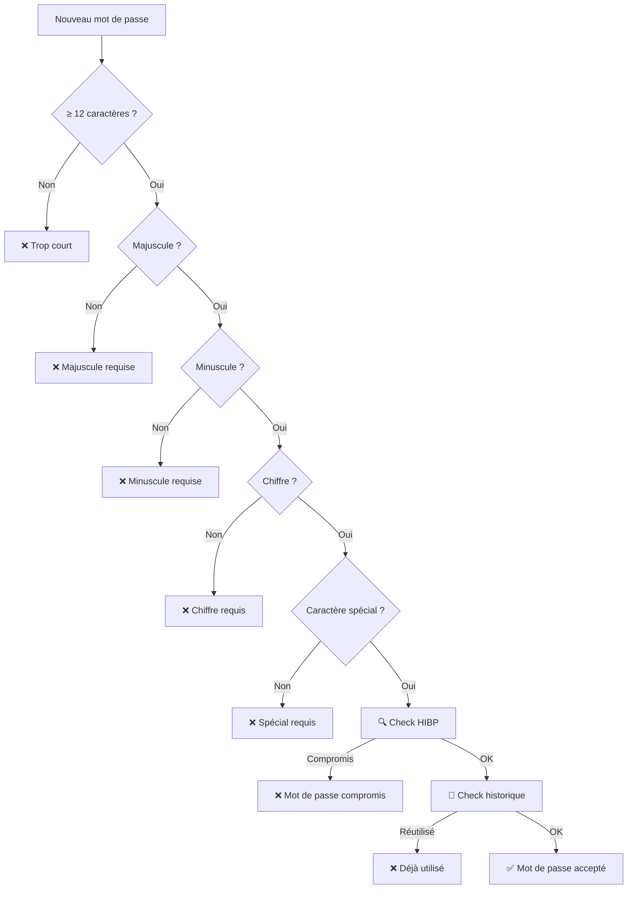
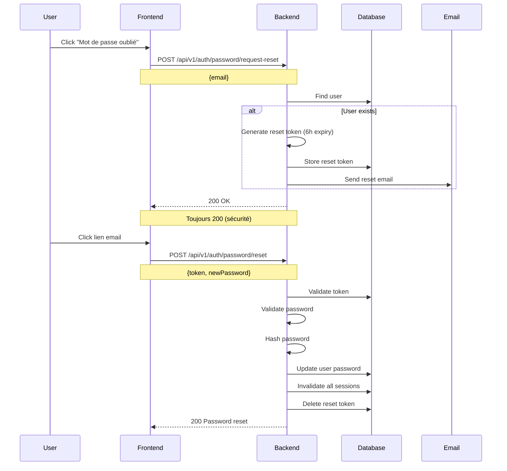
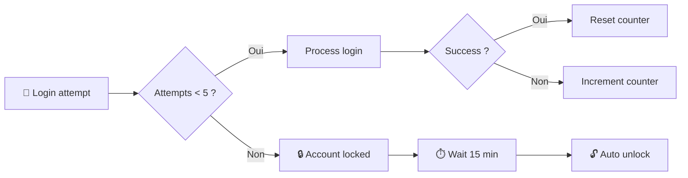

# Authentification

> Flux complet d'authentification JWT avec refresh tokens et gestion des sessions

---

## Vue d'ensemble

Le système d'authentification utilise :
- **JWT RS256** pour les access tokens (15 min)
- **Refresh tokens** en HttpOnly cookie (7 jours)
- **Argon2id** pour le hashing des mots de passe
- **HIBP** pour la vérification des mots de passe compromis

---

## Flux de Login



---

## Flux de Refresh Token



---

## Flux d'Invitation Utilisateur



---

## Gestion des Sessions

### Architecture des sessions



### Endpoints de session

| Endpoint | Méthode | Description |
|----------|---------|-------------|
| `/auth/sessions` | GET | Liste toutes les sessions actives |
| `/auth/sessions/:id` | DELETE | Révoque une session spécifique |
| `/auth/logout` | POST | Déconnexion session courante |
| `/auth/logout-all` | POST | Révoque toutes les sessions |

---

## Sécurité des Mots de Passe

### Validation



### Règles

| Règle | Valeur |
|-------|--------|
| Longueur minimum | 12 caractères |
| Majuscule | Au moins 1 |
| Minuscule | Au moins 1 |
| Chiffre | Au moins 1 |
| Caractère spécial | Au moins 1 |
| Historique | 5 derniers interdits |
| HIBP | Vérification breach |

---

## Reset Password Flow



---

## Protection Anti-Brute Force

### Mécanisme



### Configuration

| Paramètre | Valeur |
|-----------|--------|
| Max attempts | 5 |
| Lock duration | 15 minutes |
| Counter reset | After successful login |

---

## JWT Structure

### Access Token (15 min)

```json
{
  "header": {
    "alg": "RS256",
    "typ": "JWT"
  },
  "payload": {
    "sub": "user-uuid",
    "email": "user@example.com",
    "role": "employee",
    "org_id": "org-uuid",
    "exp": 1234567890,
    "iat": 1234567890
  }
}
```

### Claims utilisés

| Claim | Description |
|-------|-------------|
| `sub` | User ID (UUID) |
| `email` | Email utilisateur |
| `role` | Rôle RBAC |
| `org_id` | Organisation ID |
| `exp` | Expiration timestamp |
| `iat` | Issued at timestamp |

---

## Endpoints Auth

| Endpoint | Méthode | Auth | Description |
|----------|---------|------|-------------|
| `/auth/login` | POST | ❌ | Connexion |
| `/auth/refresh` | POST | 🍪 | Rafraîchir token |
| `/auth/logout` | POST | ✅ | Déconnexion |
| `/auth/logout-all` | POST | ✅ | Déconnexion globale |
| `/auth/me` | GET | ✅ | Profil utilisateur |
| `/auth/change-password` | PUT | ✅ | Changer mot de passe |
| `/auth/verify-invite` | POST | ❌ | Vérifier invitation |
| `/auth/accept-invite` | POST | ❌ | Accepter invitation |
| `/auth/sessions` | GET | ✅ | Lister sessions |
| `/auth/sessions/:id` | DELETE | ✅ | Révoquer session |
| `/auth/password/request-reset` | POST | ❌ | Demander reset |
| `/auth/password/reset` | POST | ❌ | Reset password |

---

## Liens connexes

- [RBAC & Permissions](./rbac.md)
- [Sécurité JWT](../security/jwt-implementation.md)
- [Protection des mots de passe](../security/password-security.md)
