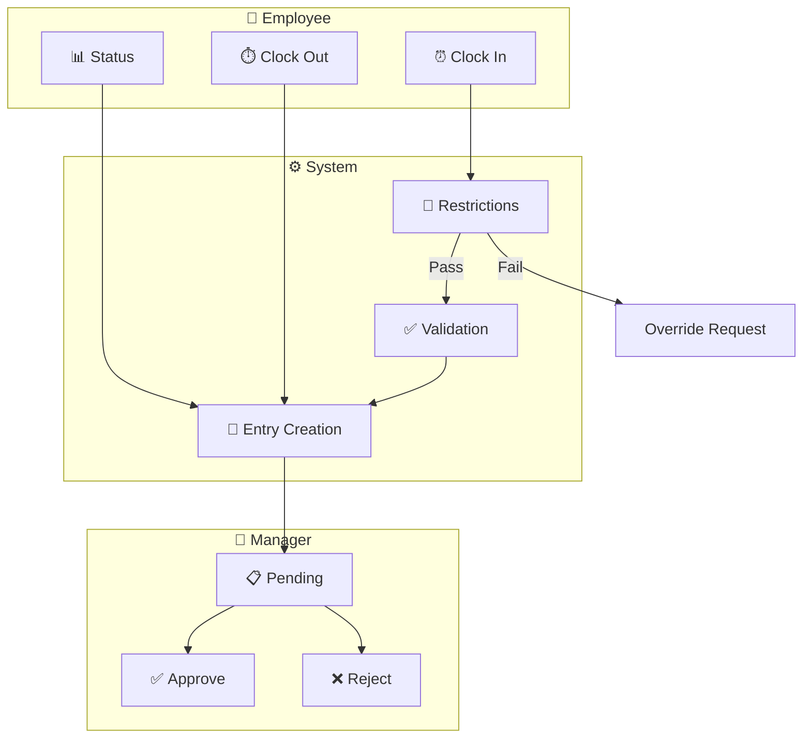
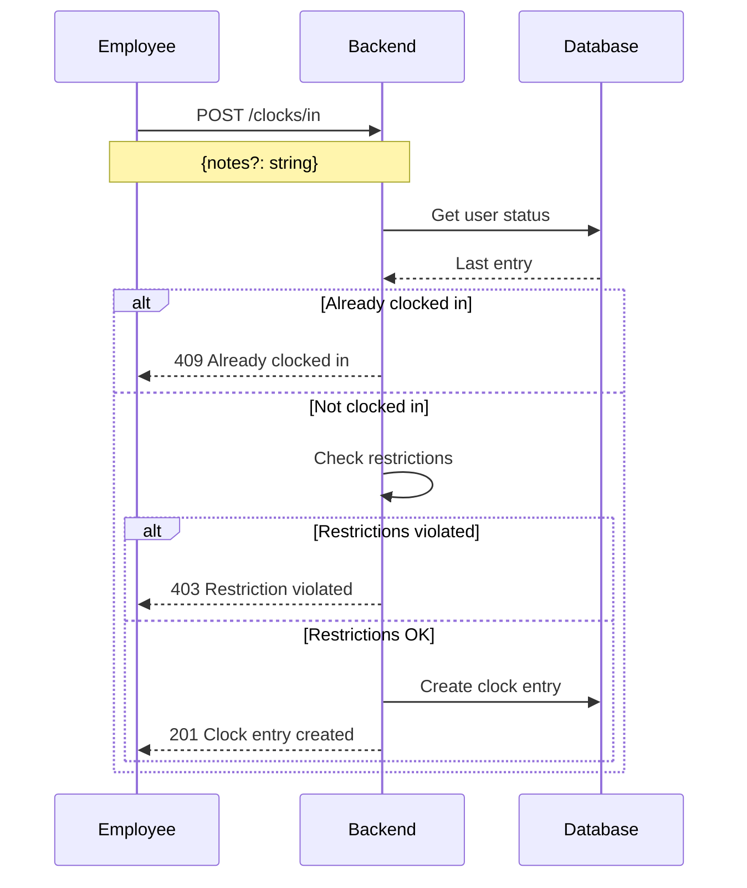
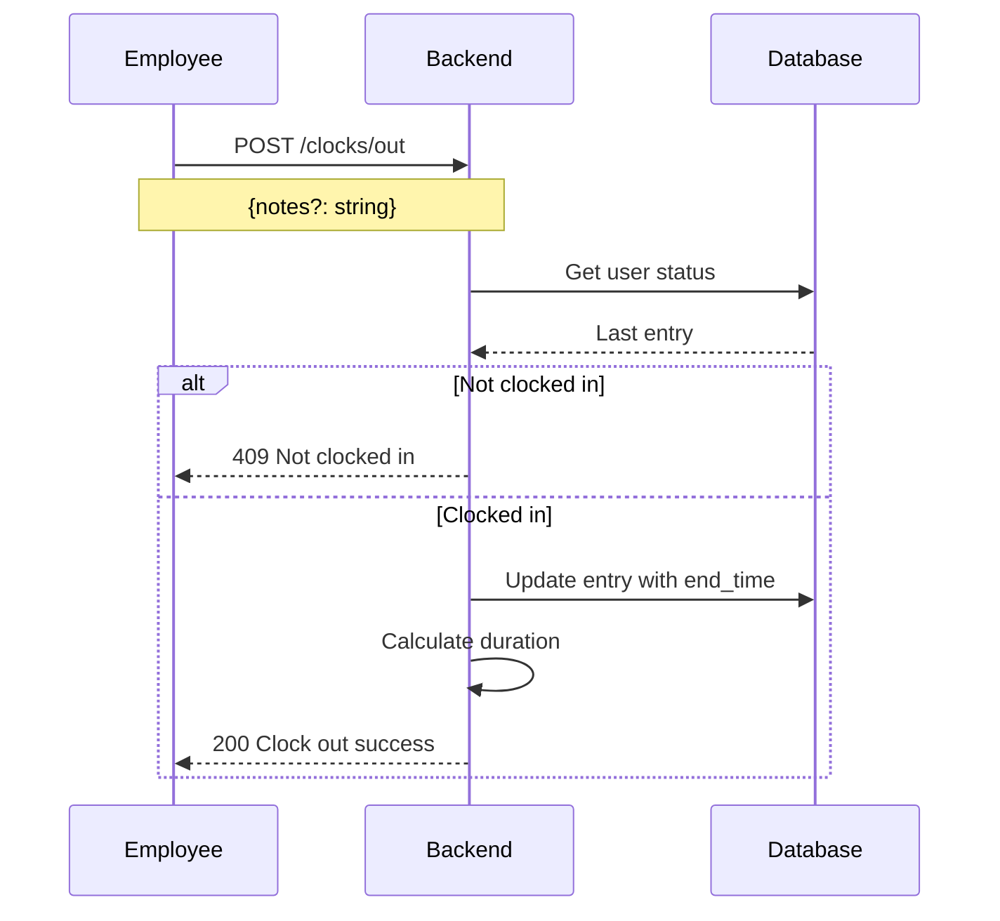
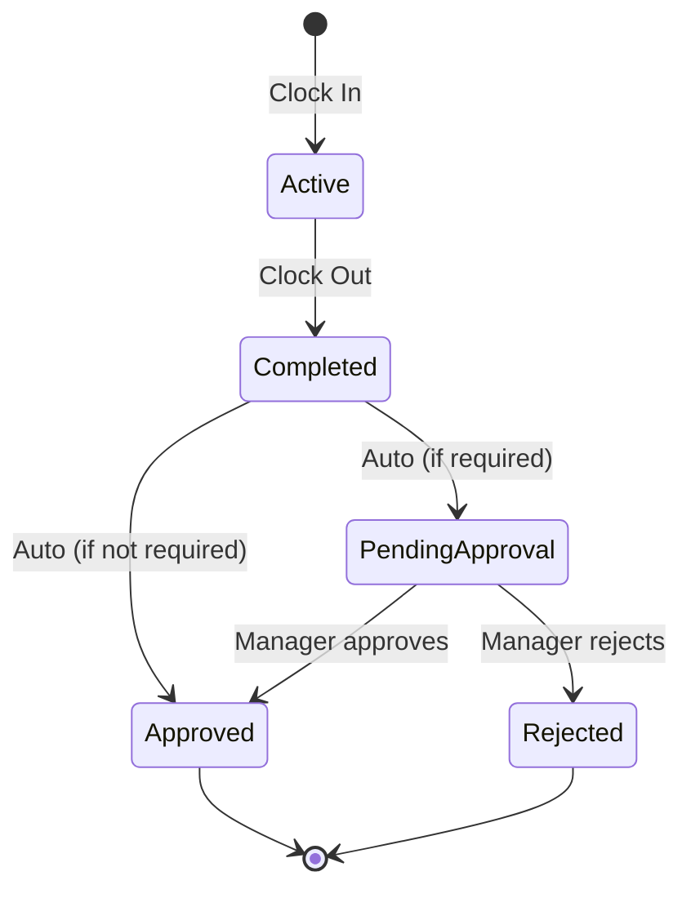
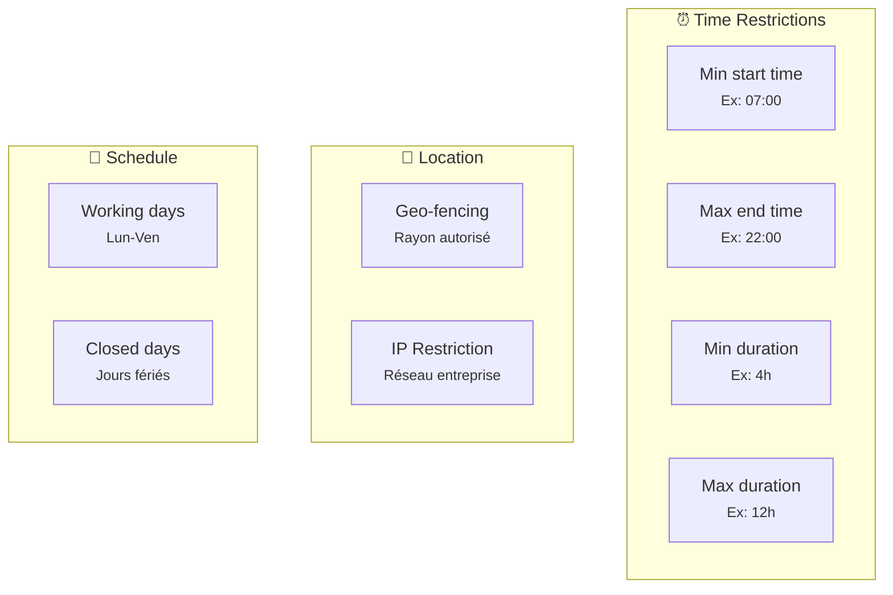
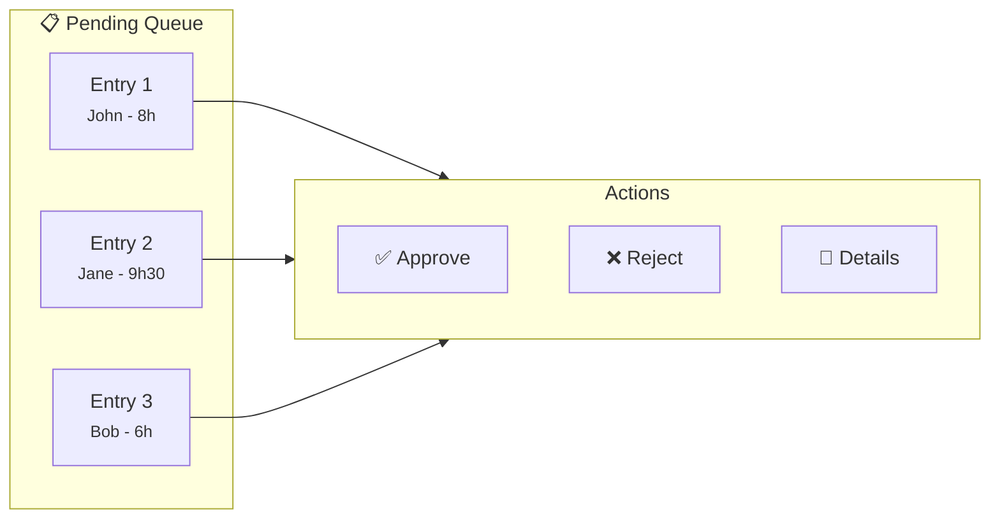
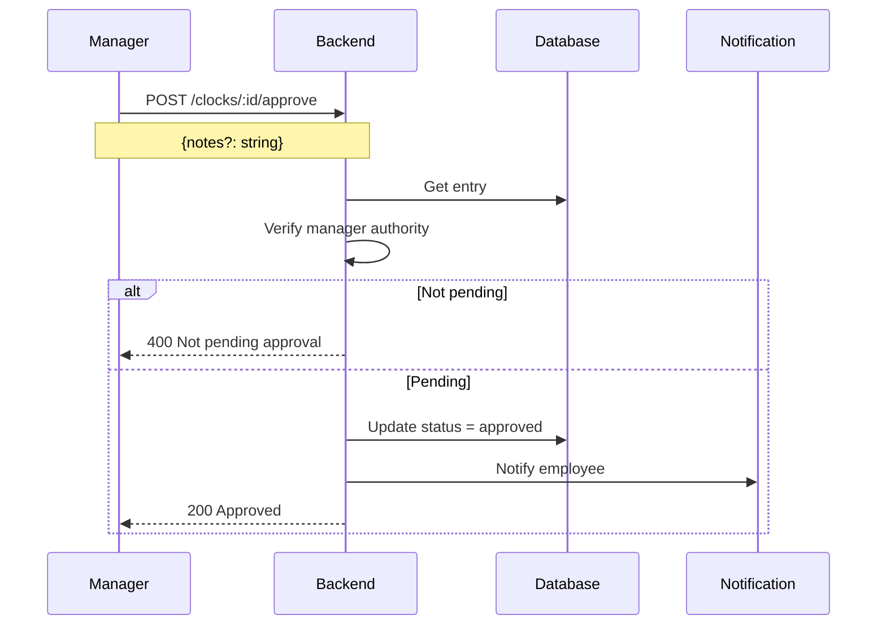
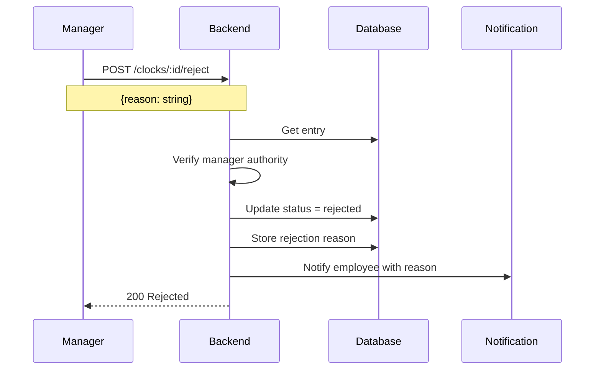
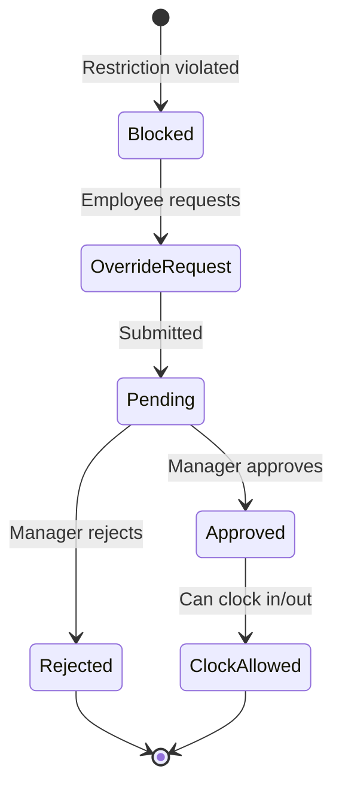
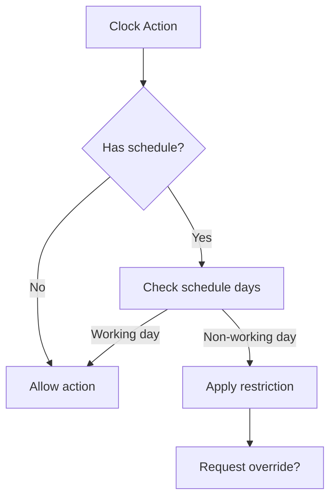

# Clock Management

> Système de pointage avec approbations et restrictions

---

## Vue d'ensemble



---

## Flux de pointage

### Clock In



### Clock Out



---

## États d'une entrée



### Statuts

| Status | Description |
|--------|-------------|
| `active` | Clock in sans clock out |
| `completed` | Clock out effectué |
| `pending_approval` | En attente de validation |
| `approved` | Validé par manager |
| `rejected` | Rejeté par manager |

---

## Restrictions de pointage

### Types de restrictions



### Configuration

```json
{
  "id": "uuid",
  "organization_id": "uuid",
  "name": "Standard Office Hours",
  "min_start_time": "07:00:00",
  "max_end_time": "22:00:00",
  "min_duration_minutes": 240,
  "max_duration_minutes": 720,
  "allowed_days": ["monday", "tuesday", "wednesday", "thursday", "friday"],
  "require_approval": true,
  "active": true
}
```

---

## Workflow d'approbation

### Vue Manager



### Approbation



### Rejet



---

## Override Requests

### Workflow



### Création d'override

```json
{
  "restriction_id": "uuid",
  "reason": "Client meeting outside office hours",
  "requested_action": "clock_in",
  "requested_time": "2024-01-15T06:30:00Z"
}
```

---

## Endpoints

### Employee

| Endpoint | Méthode | Description |
|----------|---------|-------------|
| `/clocks/in` | POST | Pointer l'arrivée |
| `/clocks/out` | POST | Pointer le départ |
| `/clocks/status` | GET | Statut actuel |
| `/clocks/history` | GET | Historique personnel |

### Manager

| Endpoint | Méthode | Description |
|----------|---------|-------------|
| `/clocks/pending` | GET | Entrées en attente |
| `/clocks/:id/approve` | POST | Approuver une entrée |
| `/clocks/:id/reject` | POST | Rejeter une entrée |

### Admin

| Endpoint | Méthode | Description |
|----------|---------|-------------|
| `/clock-restrictions` | GET/POST | Gérer les restrictions |
| `/clock-restrictions/:id` | GET/PUT/DELETE | CRUD restriction |
| `/clock-restrictions/validate` | GET | Valider une action |
| `/clock-restrictions/overrides/*` | * | Gérer les overrides |

---

## Calculs

### Durée de travail

```rust
// Calcul simple
let duration = end_time - start_time;

// Avec déduction pause
let work_duration = duration - break_duration;

// Arrondi (configurable)
let rounded = round_to_quarter_hour(work_duration);
```

### Heures supplémentaires

```rust
// Config: 8h par jour, 40h par semaine
let daily_overtime = max(0, daily_hours - 8);
let weekly_overtime = max(0, weekly_hours - 40);
```

---

## Notifications

### Événements déclencheurs

| Événement | Destinataire | Message |
|-----------|--------------|---------|
| Clock entry pending | Manager | "New entry to approve" |
| Entry approved | Employee | "Your entry was approved" |
| Entry rejected | Employee | "Your entry was rejected: {reason}" |
| Override requested | Manager | "Override request from {user}" |
| Override approved | Employee | "Override approved, you can clock in" |

---

## Intégration Planning

### Respect du planning



### Jours fériés

Les jours fériés (`closed_days`) sont automatiquement exclus du planning de travail.

---

## Rapports

### Métriques disponibles

| Métrique | Description |
|----------|-------------|
| Total heures | Somme des durées |
| Heures moyennes/jour | Moyenne journalière |
| Taux de présence | % jours travaillés |
| Retards | Clock in après heure prévue |
| Heures supplémentaires | Au-delà du planning |

### Export

```
GET /reports/export?type=clocks&from=2024-01-01&to=2024-01-31&format=csv
```

---

## Liens connexes

- [RBAC](./rbac.md)
- [Schedules](./schedules.md)
- [KPIs](./kpis.md)
