# Clock Management

> Système de pointage avec approbations et restrictions

---

## Vue d'ensemble

```mermaid
graph TB
    subgraph Employee["👤 Employee"]
        ClockIn["⏰ Clock In"]
        ClockOut["⏱️ Clock Out"]
        Status["📊 Status"]
    end

    subgraph System["⚙️ System"]
        Restrictions["🚫 Restrictions"]
        Validation["✅ Validation"]
        Entry["📝 Entry Creation"]
    end

    subgraph Manager["👔 Manager"]
        Pending["📋 Pending"]
        Approve["✅ Approve"]
        Reject["❌ Reject"]
    end

    ClockIn --> Restrictions
    Restrictions -->|Pass| Validation
    Restrictions -->|Fail| Override["Override Request"]
    Validation --> Entry
    Entry --> Pending
    Pending --> Approve
    Pending --> Reject

    ClockOut --> Entry
    Status --> Entry
```



---

## Flux de pointage

### Clock In


### Clock Out


---

## États d'une entrée


### Statuts

| Status | Description |
|--------|-------------|
| `active` | Clock in sans clock out |
| `completed` | Clock out effectué |
| `pending_approval` | En attente de validation |
| `approved` | Validé par manager |
| `rejected` | Rejeté par manager |

---

## Restrictions de pointage

### Types de restrictions

```mermaid
graph TB
    subgraph Time["⏰ Time Restrictions"]
        MinStart["Min start time<br/><small>Ex: 07:00</small>"]
        MaxEnd["Max end time<br/><small>Ex: 22:00</small>"]
        MinDuration["Min duration<br/><small>Ex: 4h</small>"]
        MaxDuration["Max duration<br/><small>Ex: 12h</small>"]
    end

    subgraph Location["📍 Location"]
        GeoFencing["Geo-fencing<br/><small>Rayon autorisé</small>"]
        IPRestrict["IP Restriction<br/><small>Réseau entreprise</small>"]
    end

    subgraph Schedule["📅 Schedule"]
        WorkDays["Working days<br/><small>Lun-Ven</small>"]
        ClosedDays["Closed days<br/><small>Jours fériés</small>"]
    end
```



### Configuration

```json
{
  "id": "uuid",
  "organization_id": "uuid",
  "name": "Standard Office Hours",
  "min_start_time": "07:00:00",
  "max_end_time": "22:00:00",
  "min_duration_minutes": 240,
  "max_duration_minutes": 720,
  "allowed_days": ["monday", "tuesday", "wednesday", "thursday", "friday"],
  "require_approval": true,
  "active": true
}
```

---

## Workflow d'approbation

### Vue Manager

```mermaid
graph LR
    subgraph Pending["📋 Pending Queue"]
        E1["Entry 1<br/><small>John - 8h</small>"]
        E2["Entry 2<br/><small>Jane - 9h30</small>"]
        E3["Entry 3<br/><small>Bob - 6h</small>"]
    end

    subgraph Actions["Actions"]
        Approve["✅ Approve"]
        Reject["❌ Reject"]
        Details["📄 Details"]
    end

    E1 --> Actions
    E2 --> Actions
    E3 --> Actions
```



### Approbation


### Rejet


---

## Override Requests

### Workflow


### Création d'override

```json
{
  "restriction_id": "uuid",
  "reason": "Client meeting outside office hours",
  "requested_action": "clock_in",
  "requested_time": "2024-01-15T06:30:00Z"
}
```

---

## Endpoints

### Employee

| Endpoint | Méthode | Description |
|----------|---------|-------------|
| `/clocks/in` | POST | Pointer l'arrivée |
| `/clocks/out` | POST | Pointer le départ |
| `/clocks/status` | GET | Statut actuel |
| `/clocks/history` | GET | Historique personnel |

### Manager

| Endpoint | Méthode | Description |
|----------|---------|-------------|
| `/clocks/pending` | GET | Entrées en attente |
| `/clocks/:id/approve` | POST | Approuver une entrée |
| `/clocks/:id/reject` | POST | Rejeter une entrée |

### Admin

| Endpoint | Méthode | Description |
|----------|---------|-------------|
| `/clock-restrictions` | GET/POST | Gérer les restrictions |
| `/clock-restrictions/:id` | GET/PUT/DELETE | CRUD restriction |
| `/clock-restrictions/validate` | GET | Valider une action |
| `/clock-restrictions/overrides/*` | * | Gérer les overrides |

---

## Calculs

### Durée de travail

```rust
// Calcul simple
let duration = end_time - start_time;

// Avec déduction pause
let work_duration = duration - break_duration;

// Arrondi (configurable)
let rounded = round_to_quarter_hour(work_duration);
```

### Heures supplémentaires

```rust
// Config: 8h par jour, 40h par semaine
let daily_overtime = max(0, daily_hours - 8);
let weekly_overtime = max(0, weekly_hours - 40);
```

---

## Notifications

### Événements déclencheurs

| Événement | Destinataire | Message |
|-----------|--------------|---------|
| Clock entry pending | Manager | "New entry to approve" |
| Entry approved | Employee | "Your entry was approved" |
| Entry rejected | Employee | "Your entry was rejected: {reason}" |
| Override requested | Manager | "Override request from {user}" |
| Override approved | Employee | "Override approved, you can clock in" |

---

## Intégration Planning

### Respect du planning


### Jours fériés

Les jours fériés (`closed_days`) sont automatiquement exclus du planning de travail.

---

## Rapports

### Métriques disponibles

| Métrique | Description |
|----------|-------------|
| Total heures | Somme des durées |
| Heures moyennes/jour | Moyenne journalière |
| Taux de présence | % jours travaillés |
| Retards | Clock in après heure prévue |
| Heures supplémentaires | Au-delà du planning |

### Export

```
GET /reports/export?type=clocks&from=2024-01-01&to=2024-01-31&format=csv
```

---

## Liens connexes

- [RBAC](./rbac.md)
- [Schedules](./schedules.md)
- [KPIs](./kpis.md)
