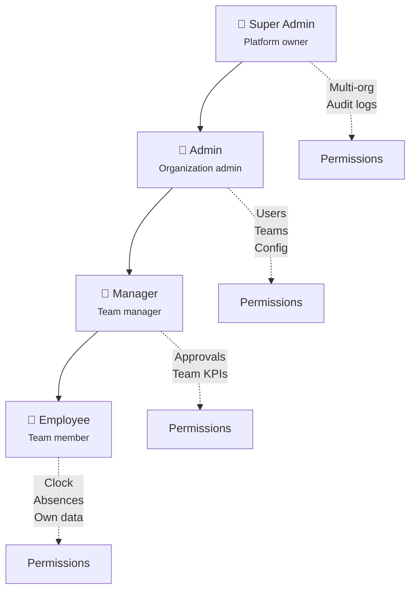
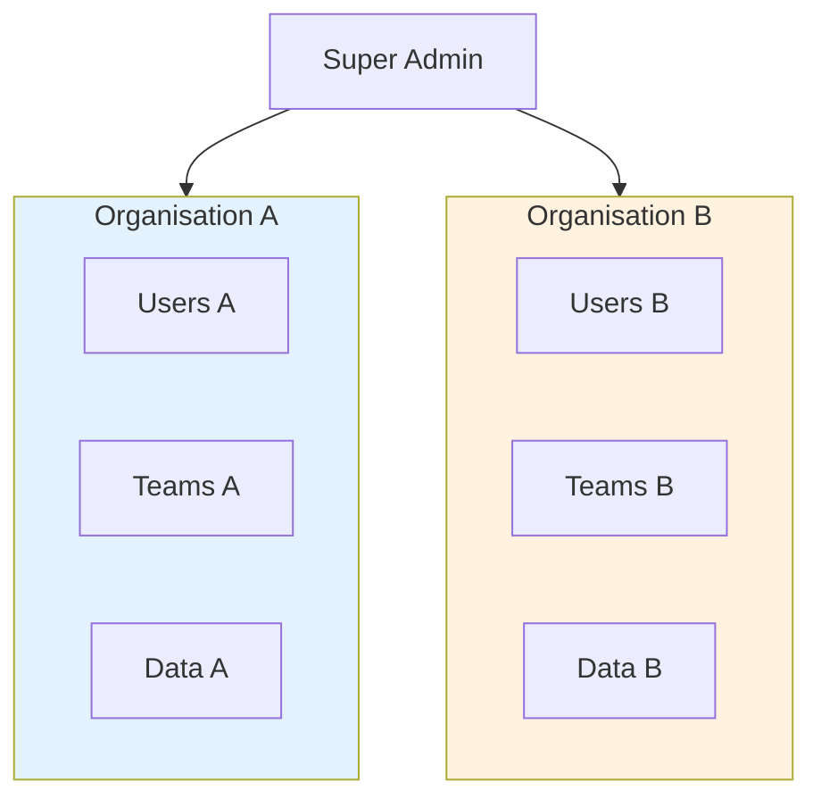

# RBAC - Role-Based Access Control

> Système de permissions hiérarchique à 4 niveaux

---

## Hiérarchie des rôles



---

## Rôles détaillés

### 👑 Super Admin

**Scope :** Toute la plateforme

| Permission | Description |
|------------|-------------|
| `organizations:*` | CRUD organisations |
| `audit_logs:read` | Accès aux logs d'audit |
| `users:*:any_org` | Gestion users cross-org |
| `system:bootstrap` | Initialisation système |

**Cas d'usage :**
- Création de nouvelles organisations
- Support technique cross-org
- Audit de conformité

### 🏢 Admin

**Scope :** Son organisation

| Permission | Description |
|------------|-------------|
| `users:*` | CRUD utilisateurs |
| `teams:*` | CRUD équipes |
| `schedules:*` | CRUD plannings |
| `absence_types:*` | Config types d'absence |
| `closed_days:*` | Jours fériés |
| `clock_restrictions:*` | Restrictions de pointage |
| `reports:export` | Export rapports |

**Cas d'usage :**
- Onboarding nouveaux employés
- Configuration de l'organisation
- Rapports globaux

### 👔 Manager

**Scope :** Ses équipes

| Permission | Description |
|------------|-------------|
| `clocks:approve` | Approuver pointages équipe |
| `absences:approve` | Approuver absences équipe |
| `kpis:team` | KPIs de l'équipe |
| `team:read` | Voir membres équipe |

**Cas d'usage :**
- Validation des heures
- Gestion des congés équipe
- Suivi de présence

### 👤 Employee

**Scope :** Ses propres données

| Permission | Description |
|------------|-------------|
| `clocks:own` | Pointer (in/out) |
| `absences:own` | Demander des absences |
| `kpis:own` | Voir ses KPIs |
| `profile:own` | Modifier son profil |
| `notifications:own` | Gérer ses notifications |

**Cas d'usage :**
- Pointage quotidien
- Demandes de congé
- Consultation de ses heures

---

## Matrice des permissions

### Gestion des utilisateurs

| Action | Employee | Manager | Admin | Super Admin |
|--------|----------|---------|-------|-------------|
| Voir son profil | ✅ | ✅ | ✅ | ✅ |
| Modifier son profil | ✅ | ✅ | ✅ | ✅ |
| Voir utilisateurs org | ❌ | ❌ | ✅ | ✅ |
| Créer utilisateur | ❌ | ❌ | ✅ | ✅ |
| Modifier utilisateur | ❌ | ❌ | ✅ | ✅ |
| Supprimer utilisateur | ❌ | ❌ | ✅ | ✅ |
| Changer rôle | ❌ | ❌ | ✅* | ✅ |

*Admin ne peut pas créer de Super Admin

### Gestion des équipes

| Action | Employee | Manager | Admin | Super Admin |
|--------|----------|---------|-------|-------------|
| Voir ses équipes | ✅ | ✅ | ✅ | ✅ |
| Voir toutes équipes | ❌ | ❌ | ✅ | ✅ |
| Créer équipe | ❌ | ❌ | ✅ | ✅ |
| Modifier équipe | ❌ | ❌ | ✅ | ✅ |
| Ajouter membre | ❌ | ❌ | ✅ | ✅ |
| Retirer membre | ❌ | ❌ | ✅ | ✅ |

### Pointage

| Action | Employee | Manager | Admin | Super Admin |
|--------|----------|---------|-------|-------------|
| Clock in/out | ✅ | ✅ | ✅ | ✅ |
| Voir son historique | ✅ | ✅ | ✅ | ✅ |
| Voir historique équipe | ❌ | ✅ | ✅ | ✅ |
| Approuver pointages | ❌ | ✅ | ✅ | ✅ |
| Config restrictions | ❌ | ❌ | ✅ | ✅ |

### Absences

| Action | Employee | Manager | Admin | Super Admin |
|--------|----------|---------|-------|-------------|
| Créer demande | ✅ | ✅ | ✅ | ✅ |
| Voir ses demandes | ✅ | ✅ | ✅ | ✅ |
| Annuler sa demande | ✅ | ✅ | ✅ | ✅ |
| Voir demandes équipe | ❌ | ✅ | ✅ | ✅ |
| Approuver demande | ❌ | ✅ | ✅ | ✅ |
| Config types absence | ❌ | ❌ | ✅ | ✅ |

### KPIs & Rapports

| Action | Employee | Manager | Admin | Super Admin |
|--------|----------|---------|-------|-------------|
| Voir ses KPIs | ✅ | ✅ | ✅ | ✅ |
| Voir KPIs équipe | ❌ | ✅ | ✅ | ✅ |
| Voir KPIs org | ❌ | ❌ | ✅ | ✅ |
| Export rapports | ❌ | ❌ | ✅ | ✅ |

---

## Isolation multi-tenant

### Architecture



### Règles d'isolation

1. **User → Organization** : 1:1 (un user appartient à une seule org)
2. **Data filtering** : Toutes les requêtes filtrées par `organization_id`
3. **Cross-org access** : Super Admin uniquement
4. **Team scope** : Manager voit uniquement ses équipes

---

## Implémentation technique

### Middleware d'autorisation

```rust
// Vérification dans chaque handler
pub async fn some_handler(
    AuthUser(user): AuthUser,  // Extrait le user du JWT
    Path(resource_id): Path<Uuid>,
) -> Result<Json<Resource>, ApiError> {
    // 1. Vérifier le rôle minimum
    user.require_role(Role::Manager)?;

    // 2. Vérifier l'accès à la ressource
    let resource = get_resource(resource_id).await?;
    user.can_access(&resource)?;

    // 3. Traitement
    Ok(Json(resource))
}
```

### Guards de rôle

```rust
impl User {
    pub fn require_role(&self, min_role: Role) -> Result<(), AuthError> {
        if self.role >= min_role {
            Ok(())
        } else {
            Err(AuthError::InsufficientPermissions)
        }
    }

    pub fn can_access(&self, resource: &impl OrgScoped) -> Result<(), AuthError> {
        // Super Admin peut tout voir
        if self.role == Role::SuperAdmin {
            return Ok(());
        }

        // Sinon, vérifier l'organisation
        if self.organization_id == resource.organization_id() {
            Ok(())
        } else {
            Err(AuthError::AccessDenied)
        }
    }
}
```

---

## Changement de rôle

### Règles

| Action | Qui peut | Contraintes |
|--------|----------|-------------|
| Employee → Manager | Admin | - |
| Manager → Admin | Admin | Max 1 Admin par org |
| Admin → Super Admin | Super Admin | - |
| Downgrade | Admin/Super Admin | Pas soi-même |

### Audit

Tout changement de rôle est logué :

```json
{
  "event": "user.role.changed",
  "actor_id": "admin-uuid",
  "target_id": "user-uuid",
  "old_role": "employee",
  "new_role": "manager",
  "timestamp": "2024-01-15T10:30:00Z"
}
```

---

## Endpoints par rôle

### Public (non authentifié)

```
POST /auth/login
POST /auth/refresh
POST /auth/password/request-reset
POST /auth/password/reset
POST /auth/verify-invite
POST /auth/accept-invite
GET  /system/status
```

### Employee+

```
GET    /auth/me
PUT    /auth/change-password
POST   /auth/logout
GET    /auth/sessions
DELETE /auth/sessions/:id

POST   /clocks/in
POST   /clocks/out
GET    /clocks/status
GET    /clocks/history

POST   /absences
GET    /absences
GET    /absences/:id
POST   /absences/:id/cancel

GET    /balances/me
GET    /kpis/me
GET    /notifications
PUT    /notifications/:id/read
```

### Manager+

```
GET    /clocks/pending
POST   /clocks/:id/approve
POST   /clocks/:id/reject

GET    /absences/pending
POST   /absences/:id/approve
POST   /absences/:id/reject

GET    /kpis/teams/:id
GET    /teams/my
```

### Admin+

```
GET    /users
POST   /users
GET    /users/:id
PUT    /users/:id
DELETE /users/:id

GET    /teams
POST   /teams
PUT    /teams/:id
DELETE /teams/:id

GET    /schedules
POST   /schedules
...

GET    /reports/export
```

### Super Admin

```
GET    /organizations
POST   /organizations
PUT    /organizations/:id
DELETE /organizations/:id

GET    /audit-logs
GET    /audit-logs/export
POST   /auth/bootstrap
```

---

## Liens connexes

- [Auth Flow](./auth-flow.md)
- [Security](../security/)
- [API Reference](../api/)
