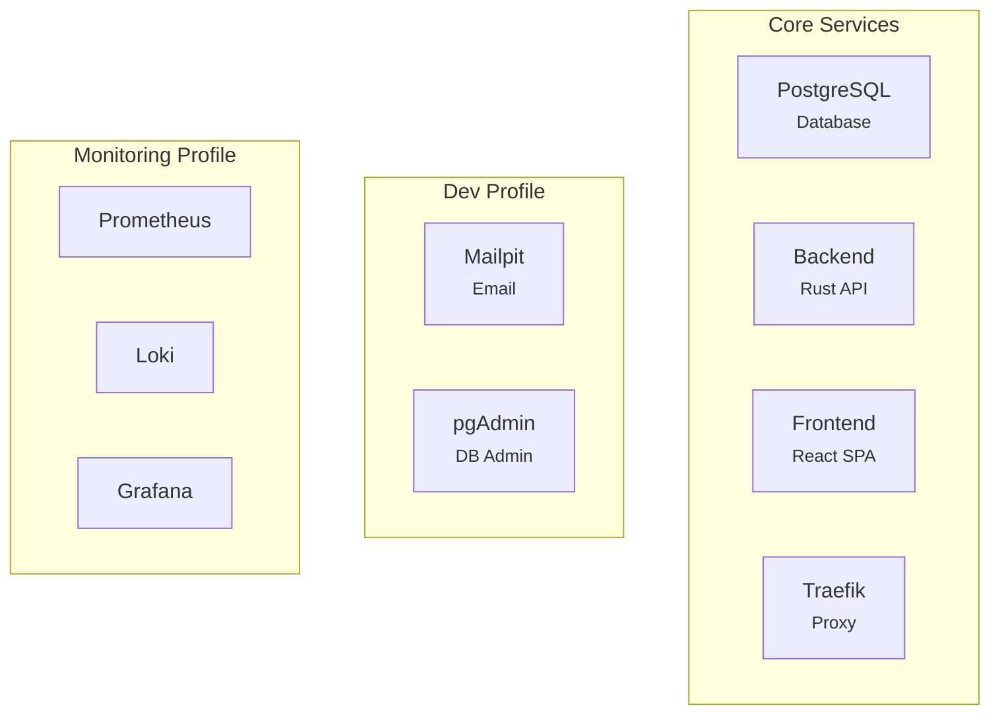

# Installation

> Guide d'installation complet de Time Manager

---

## Prérequis

### Logiciels requis

| Logiciel | Version minimum | Vérification |
|----------|-----------------|--------------|
| Docker | 24.0+ | `docker --version` |
| Docker Compose | v2.0+ | `docker compose version` |
| Git | 2.x | `git --version` |

### Ressources recommandées

| Ressource | Dev | Prod |
|-----------|-----|------|
| RAM | 4 GB | 8 GB |
| CPU | 2 cores | 4 cores |
| Disk | 10 GB | 50 GB |

---

## Installation

### 1. Cloner le repository

```bash
git clone <repository-url>
cd time-manager
```

### 2. Configurer l'environnement

```bash
# Copier le fichier exemple
cp .env.dev.example .env

# Éditer si nécessaire
nano .env
```

### 3. Générer les clés JWT (optionnel)

```bash
# Les clés par défaut sont incluses pour le dev
# Pour production, générer de nouvelles clés :
mkdir -p backend/keys
openssl genrsa -out backend/keys/private.pem 2048
openssl rsa -in backend/keys/private.pem -pubout -out backend/keys/public.pem
```

### 4. Lancer les services

```bash
# Mode développement (avec hot reload)
docker compose --profile dev up -d

# Avec monitoring
docker compose --profile dev --profile monitoring up -d
```

### 5. Vérifier le statut

```bash
# Voir les logs
docker compose logs -f

# Vérifier les containers
docker compose ps
```

---

## Modes de déploiement

### Development

```bash
docker compose --profile dev up -d
```

**Inclut :**
- Hot reload (backend + frontend)
- Mailpit (emails)
- pgAdmin (DB admin)
- Seeder automatique

### Production

```bash
docker compose -f docker-compose.prod.yml up -d
```

**Caractéristiques :**
- Images optimisées
- TLS automatique (Let's Encrypt)
- Pas de seeder
- Logging structuré

### Avec Monitoring

```bash
# Dev + Monitoring
docker compose --profile dev --profile monitoring up -d

# Prod + Monitoring
docker compose -f docker-compose.prod.yml --profile monitoring up -d
```

**Ajoute :**
- Prometheus
- Loki
- Tempo
- Grafana
- cAdvisor
- Promtail

---

## Structure des services



---

## Vérification de l'installation

### Health check API

```bash
curl http://localhost:8000/api/health
# {"status": "ok"}
```

### Test de connexion

```bash
curl -X POST http://localhost:8000/api/v1/auth/login \
  -H "Content-Type: application/json" \
  -d '{"email": "admin@acme.local", "password": "Admin123!"}'
```

### Vérifier la base de données

```bash
docker compose exec postgres psql -U timemanager -d timemanager -c "\dt"
```

---

## Troubleshooting

### Port déjà utilisé

```bash
# Identifier le processus
lsof -i :8000

# Ou modifier le port dans .env
APP_PORT=8001
```

### Container qui ne démarre pas

```bash
# Voir les logs
docker compose logs backend

# Restart un service
docker compose restart backend
```

### Base de données vide

```bash
# Relancer les migrations
docker compose exec backend diesel migration run

# Ou recréer le container
docker compose down -v
docker compose --profile dev up -d
```

### Permission denied (Docker)

```bash
# Linux uniquement
sudo usermod -aG docker $USER
newgrp docker
```

---

## Désinstallation

```bash
# Arrêter les services
docker compose down

# Supprimer les volumes (données)
docker compose down -v

# Supprimer les images
docker compose down --rmi all
```

---

## Liens connexes

- [Configuration](./configuration.md)
- [Quickstart](./quickstart.md)
- [Docker](../devops/docker.md)
