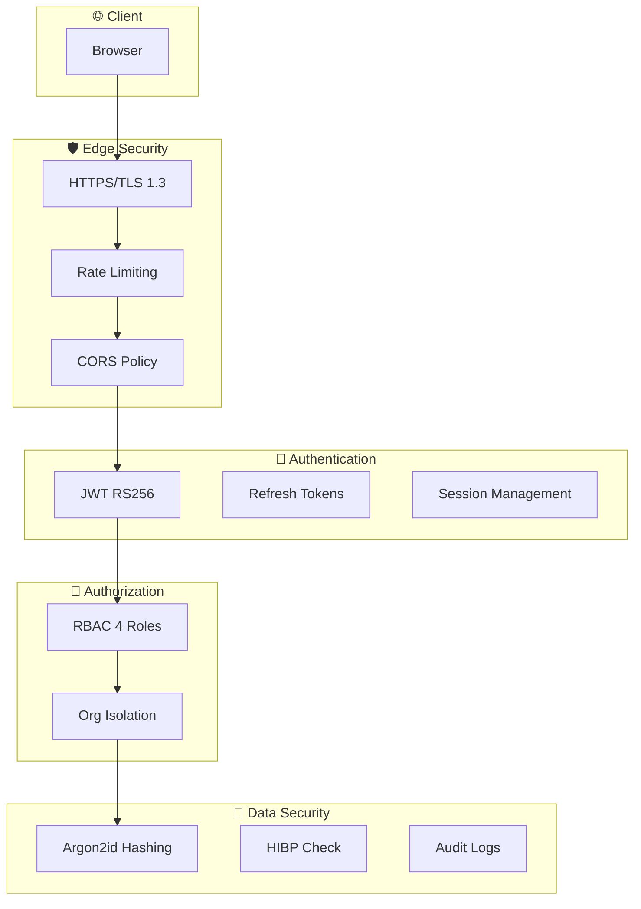

# Sécurité

> Vue d'ensemble des mécanismes de sécurité de Time Manager

---

## Architecture de sécurité



---

## Protections implémentées

| Couche | Protection | Implémentation |
|--------|------------|----------------|
| **Transport** | TLS 1.3 | Traefik + Let's Encrypt |
| **Edge** | Rate Limiting | Traefik middleware |
| **Edge** | CORS | Axum CorsLayer |
| **Auth** | JWT RS256 | Clés RSA 2048-bit |
| **Auth** | Refresh Tokens | HttpOnly cookies |
| **Auth** | Brute Force | Account lockout |
| **Password** | Hashing | Argon2id |
| **Password** | Breach Check | HIBP k-anonymity |
| **Access** | RBAC | 4 rôles hiérarchiques |
| **Data** | Multi-tenant | Isolation par org_id |
| **Audit** | Logging | Actions sensibles tracées |

---

## Documentation détaillée

| Document | Description |
|----------|-------------|
| [JWT Implementation](./jwt-implementation.md) | Access/refresh tokens, rotation |
| [Password Security](./password-security.md) | Argon2, HIBP, historique |
| [Protection Mechanisms](./protection-mechanisms.md) | Rate limit, CSRF, brute force |

---

## OWASP Top 10 Coverage

| Risque | Statut | Mesures |
|--------|--------|---------|
| **A01 Broken Access Control** | ✅ | RBAC, org isolation |
| **A02 Cryptographic Failures** | ✅ | RS256, Argon2id, TLS |
| **A03 Injection** | ✅ | Diesel ORM (prepared statements) |
| **A04 Insecure Design** | ✅ | Security by design |
| **A05 Security Misconfiguration** | ✅ | Env vars, secure defaults |
| **A06 Vulnerable Components** | ✅ | Dependabot, cargo audit |
| **A07 Authentication Failures** | ✅ | JWT, brute force protection |
| **A08 Software/Data Integrity** | ✅ | Signed tokens, audit logs |
| **A09 Logging/Monitoring** | ✅ | Structured logging, Grafana |
| **A10 SSRF** | ✅ | No outbound user URLs |

---

## Headers de sécurité

```yaml
# Traefik security headers
X-Content-Type-Options: nosniff
X-Frame-Options: DENY
X-XSS-Protection: 1; mode=block
Referrer-Policy: strict-origin-when-cross-origin
Content-Security-Policy: default-src 'self'
Strict-Transport-Security: max-age=31536000; includeSubDomains
```

---

## Checklist sécurité

### ✅ Authentication
- [x] JWT avec RS256 (asymétrique)
- [x] Refresh tokens en HttpOnly cookies
- [x] Rotation automatique des tokens
- [x] Logout global (toutes sessions)

### ✅ Password
- [x] Argon2id (memory-hard)
- [x] Règles de complexité strictes
- [x] Vérification HIBP
- [x] Historique des 5 derniers

### ✅ Authorization
- [x] RBAC 4 niveaux
- [x] Isolation multi-tenant
- [x] Permissions granulaires

### ✅ Infrastructure
- [x] TLS 1.3 obligatoire
- [x] Rate limiting global
- [x] Security headers
- [x] Audit logging

---

## Liens connexes

- [Auth Flow](../features/auth-flow.md)
- [RBAC & Permissions](../features/rbac.md)
