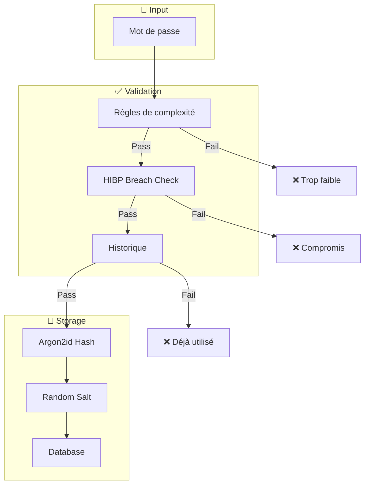
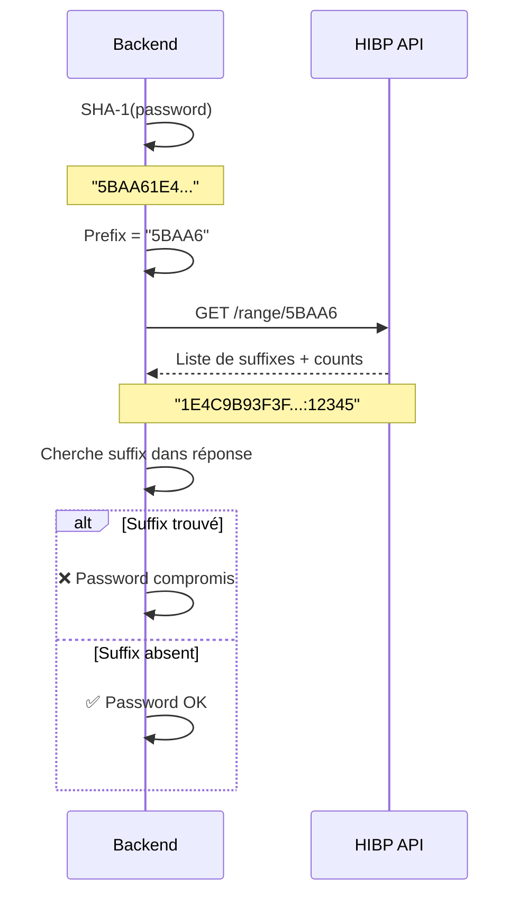
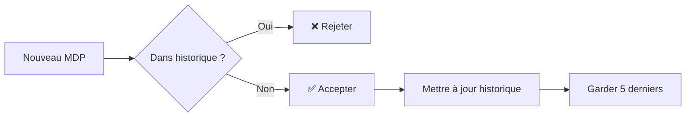
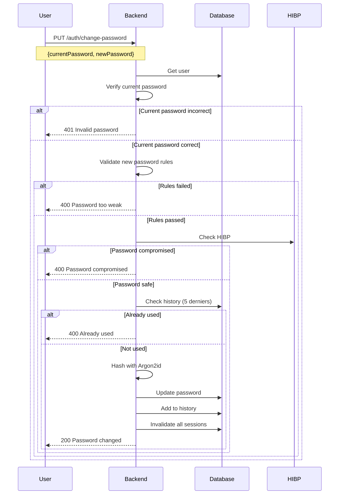

# Password Security

> Sécurisation des mots de passe avec Argon2id et HIBP

---

## Vue d'ensemble



---

## Règles de complexité

### Exigences

| Règle | Minimum | Exemple valide |
|-------|---------|----------------|
| Longueur | 12 caractères | `MyP@ssw0rd123` |
| Majuscules | 1 | `M` |
| Minuscules | 1 | `y` |
| Chiffres | 1 | `0` |
| Spéciaux | 1 | `@` |

### Caractères spéciaux acceptés

```
!@#$%^&*()_+-=[]{}|;':",.<>?/`~
```

### Validation Rust

```rust
pub fn validate_password(password: &str) -> Result<(), PasswordError> {
    if password.len() < 12 {
        return Err(PasswordError::TooShort);
    }

    let has_upper = password.chars().any(|c| c.is_uppercase());
    let has_lower = password.chars().any(|c| c.is_lowercase());
    let has_digit = password.chars().any(|c| c.is_numeric());
    let has_special = password.chars().any(|c| !c.is_alphanumeric());

    if !has_upper { return Err(PasswordError::MissingUppercase); }
    if !has_lower { return Err(PasswordError::MissingLowercase); }
    if !has_digit { return Err(PasswordError::MissingDigit); }
    if !has_special { return Err(PasswordError::MissingSpecial); }

    Ok(())
}
```

---

## Argon2id Hashing

### Pourquoi Argon2id ?

| Algorithme | CPU-hard | Memory-hard | Side-channel resistant |
|------------|----------|-------------|------------------------|
| bcrypt | ✅ | ❌ | ✅ |
| scrypt | ✅ | ✅ | ❌ |
| **Argon2id** | ✅ | ✅ | ✅ |

**Argon2id** combine les avantages de Argon2i (résistant aux side-channels) et Argon2d (résistant au GPU cracking).

### Paramètres utilisés

```rust
// Configuration Argon2id
let params = Params::new(
    65536,  // Memory: 64 MB
    3,      // Iterations: 3
    4,      // Parallelism: 4 threads
    None    // Output length: default (32 bytes)
)?;
```

| Paramètre | Valeur | Impact |
|-----------|--------|--------|
| Memory | 64 MB | Coût GPU élevé |
| Iterations | 3 | ~100ms par hash |
| Parallelism | 4 | Utilise 4 cores |
| Salt | 16 bytes random | Unique par hash |

### Format du hash stocké

```
$argon2id$v=19$m=65536,t=3,p=4$<base64_salt>$<base64_hash>
```

---

## HIBP Integration

### Fonctionnement



### K-Anonymity

Le protocole utilise **k-anonymity** :
1. Hash SHA-1 du mot de passe
2. Envoyer uniquement les 5 premiers caractères
3. HIBP ne connaît jamais le mot de passe complet
4. Recevoir tous les hash commençant par ce préfixe
5. Vérifier localement si le hash complet existe

### Configuration

```env
# Activer/désactiver HIBP
HIBP_ENABLED=true

# Timeout API (ms)
HIBP_TIMEOUT=5000
```

### Gestion des erreurs

| Situation | Comportement |
|-----------|--------------|
| HIBP timeout | Password accepté (fail-open) |
| HIBP erreur | Password accepté (fail-open) |
| HIBP désactivé | Check ignoré |

---

## Historique des mots de passe

### Fonctionnement



### Table `password_history`

```sql
CREATE TABLE password_history (
    id UUID PRIMARY KEY,
    user_id UUID NOT NULL REFERENCES users(id),
    password_hash VARCHAR NOT NULL,
    created_at TIMESTAMPTZ NOT NULL DEFAULT NOW()
);

CREATE INDEX idx_password_history_user
    ON password_history(user_id, created_at DESC);
```

### Vérification

```rust
pub async fn check_password_history(
    user_id: Uuid,
    new_password: &str,
    conn: &mut PgConnection
) -> Result<bool, Error> {
    // Récupérer les 5 derniers hash
    let history = password_history::table
        .filter(password_history::user_id.eq(user_id))
        .order(password_history::created_at.desc())
        .limit(5)
        .load::<PasswordHistory>(conn)?;

    // Vérifier contre chaque hash
    for entry in history {
        if verify_password(new_password, &entry.password_hash)? {
            return Ok(false); // Password déjà utilisé
        }
    }

    Ok(true) // Password OK
}
```

---

## Flux de changement de mot de passe



---

## Erreurs retournées

| Code | Message | Cause |
|------|---------|-------|
| 400 | `Password must be at least 12 characters` | Trop court |
| 400 | `Password must contain uppercase letter` | Pas de majuscule |
| 400 | `Password must contain lowercase letter` | Pas de minuscule |
| 400 | `Password must contain digit` | Pas de chiffre |
| 400 | `Password must contain special character` | Pas de spécial |
| 400 | `Password has been compromised` | Trouvé dans HIBP |
| 400 | `Password was recently used` | Dans historique |

---

## Bonnes pratiques utilisateur

### ✅ Recommandé

- Utiliser un gestionnaire de mots de passe
- Générer des mots de passe aléatoires (20+ caractères)
- Unique pour chaque service
- Activer 2FA quand disponible

### ❌ À éviter

- Mots du dictionnaire
- Informations personnelles (nom, date)
- Patterns communs (123456, qwerty)
- Réutilisation entre services

---

## Liens connexes

- [JWT Implementation](./jwt-implementation.md)
- [Protection Mechanisms](./protection-mechanisms.md)
- [Auth Flow](../features/auth-flow.md)
