# Protection Mechanisms

> Rate limiting, protection brute force et CSRF

---

## Vue d'ensemble

```mermaid
graph TB
    subgraph Request["📨 Incoming Request"]
        Client["Client"]
    end

    subgraph Edge["🛡️ Edge Protection"]
        TLS["TLS 1.3"]
        RateLimit["Rate Limiting<br/><small>Traefik</small>"]
        Headers["Security Headers"]
    end

    subgraph App["⚙️ Application Protection"]
        CORS["CORS Policy"]
        CSRF["CSRF Validation"]
        BruteForce["Brute Force Protection"]
        Auth["Authentication"]
    end

    subgraph Backend["🔒 Backend Protection"]
        RBAC["RBAC Authorization"]
        Validation["Input Validation"]
        Audit["Audit Logging"]
    end

    Client --> TLS
    TLS --> RateLimit
    RateLimit --> Headers
    Headers --> CORS
    CORS --> CSRF
    CSRF --> BruteForce
    BruteForce --> Auth
    Auth --> RBAC
    RBAC --> Validation
    Validation --> Audit
```



---

## Rate Limiting

### Configuration Traefik

```yaml
# infrastructure/traefik/dynamic.yml
http:
  middlewares:
    rate-limit-global:
      rateLimit:
        average: 100     # 100 req/s moyenne
        burst: 200       # Burst jusqu'à 200
        period: 1s
        sourceCriterion:
          requestHost: true
```

### Endpoints avec limites spéciales

| Endpoint | Limite | Raison |
|----------|--------|--------|
| `/auth/login` | 5/min par IP | Anti brute-force |
| `/auth/password/request-reset` | 3/h par email | Anti spam |
| `/auth/password/reset` | 5/h par token | Anti brute-force |
| `*` (global) | 100/s | Protection DDoS |

### Réponse en cas de limite

```http
HTTP/1.1 429 Too Many Requests
Retry-After: 60
Content-Type: application/json

{
  "error": "too_many_requests",
  "message": "Rate limit exceeded. Please try again later.",
  "retry_after": 60
}
```

---

## Protection Brute Force

### Mécanisme de verrouillage


### Configuration

| Paramètre | Valeur | Description |
|-----------|--------|-------------|
| `MAX_FAILED_ATTEMPTS` | 5 | Tentatives avant lock |
| `LOCKOUT_DURATION` | 15 min | Durée du verrouillage |
| `RESET_ON_SUCCESS` | true | Reset compteur si succès |

### Implémentation

```rust
pub async fn check_brute_force(
    user: &User,
    db: &mut PgConnection
) -> Result<(), AuthError> {
    if user.failed_login_attempts >= 5 {
        if let Some(locked_until) = user.locked_until {
            if locked_until > Utc::now() {
                return Err(AuthError::AccountLocked {
                    until: locked_until,
                });
            }
        }
    }
    Ok(())
}

pub async fn handle_failed_login(
    user_id: Uuid,
    db: &mut PgConnection
) -> Result<(), Error> {
    let attempts = increment_failed_attempts(user_id, db).await?;

    if attempts >= 5 {
        let locked_until = Utc::now() + Duration::minutes(15);
        lock_account(user_id, locked_until, db).await?;
    }

    Ok(())
}
```

### Réponse compte verrouillé

```json
{
  "error": "account_locked",
  "message": "Account temporarily locked due to multiple failed attempts",
  "locked_until": "2024-01-15T10:30:00Z"
}
```

---

## CORS Policy

### Configuration

```rust
let cors = CorsLayer::new()
    .allow_origin(AllowOrigin::list(allowed_origins))
    .allow_methods([
        Method::GET,
        Method::POST,
        Method::PUT,
        Method::DELETE,
        Method::PATCH,
        Method::OPTIONS,
    ])
    .allow_headers([
        CONTENT_TYPE,
        AUTHORIZATION,
        ACCEPT,
        HeaderName::from_static("x-csrf-token"),
    ])
    .allow_credentials(true);
```

### Origines autorisées

| Environnement | Origines |
|---------------|----------|
| Development | `http://localhost:3000`, `http://localhost:5173` |
| Production | `https://time-manager.app` |

### Headers CORS

```http
Access-Control-Allow-Origin: https://time-manager.app
Access-Control-Allow-Methods: GET, POST, PUT, DELETE, PATCH
Access-Control-Allow-Headers: Content-Type, Authorization, X-CSRF-Token
Access-Control-Allow-Credentials: true
Access-Control-Max-Age: 86400
```

---

## CSRF Protection

### Double Submit Cookie Pattern


### Implémentation Frontend

```typescript
// Extraire le token du cookie
const getCsrfToken = (): string | null => {
  const match = document.cookie.match(/csrf_token=([^;]+)/);
  return match ? match[1] : null;
};

// Ajouter aux requêtes
axios.interceptors.request.use((config) => {
  const token = getCsrfToken();
  if (token) {
    config.headers['X-CSRF-Token'] = token;
  }
  return config;
});
```

### Endpoints protégés

Tous les endpoints mutants (POST, PUT, DELETE, PATCH) nécessitent le token CSRF.

---

## Security Headers

### Headers Traefik

```yaml
http:
  middlewares:
    security-headers:
      headers:
        # Prevent MIME sniffing
        contentTypeNosniff: true

        # Clickjacking protection
        frameDeny: true

        # XSS Filter
        browserXssFilter: true

        # Referrer policy
        referrerPolicy: "strict-origin-when-cross-origin"

        # HSTS
        stsSeconds: 31536000
        stsIncludeSubdomains: true
        stsPreload: true

        # CSP
        contentSecurityPolicy: >
          default-src 'self';
          script-src 'self' 'unsafe-inline';
          style-src 'self' 'unsafe-inline';
          img-src 'self' data: https:;
          font-src 'self';
          connect-src 'self' https://api.haveibeenpwned.com;
```

### Explication des headers

| Header | Valeur | Protection |
|--------|--------|------------|
| `X-Content-Type-Options` | nosniff | MIME sniffing |
| `X-Frame-Options` | DENY | Clickjacking |
| `X-XSS-Protection` | 1; mode=block | XSS basique |
| `Referrer-Policy` | strict-origin-when-cross-origin | Fuite URL |
| `Strict-Transport-Security` | max-age=31536000 | Downgrade HTTPS |
| `Content-Security-Policy` | ... | XSS, injection |

---

## Input Validation

### Validation automatique (Axum + Validator)

```rust
#[derive(Debug, Deserialize, Validate)]
pub struct CreateUserRequest {
    #[validate(email)]
    pub email: String,

    #[validate(length(min = 2, max = 100))]
    pub first_name: String,

    #[validate(length(min = 2, max = 100))]
    pub last_name: String,

    #[validate(custom = "validate_role")]
    pub role: UserRole,
}

pub async fn create_user(
    Json(payload): Json<CreateUserRequest>
) -> Result<Json<UserResponse>, ApiError> {
    payload.validate()?; // Validation automatique
    // ...
}
```

### Types de validation

| Type | Validation | Exemple |
|------|------------|---------|
| Email | Format RFC 5322 | `user@example.com` |
| UUID | Format UUID v4 | `550e8400-e29b-...` |
| String | Length min/max | 2-100 caractères |
| Enum | Valeurs autorisées | `employee`, `manager` |
| Date | Format ISO 8601 | `2024-01-15` |
| Custom | Logique métier | Rôle valide |

---

## Audit Logging

### Événements tracés

| Événement | Données loguées |
|-----------|-----------------|
| Login success | user_id, ip, user_agent |
| Login failure | email, ip, reason |
| Password change | user_id, ip |
| User creation | admin_id, new_user_id |
| Role change | admin_id, user_id, old_role, new_role |
| Session revocation | user_id, session_id |

### Structure du log

```json
{
  "timestamp": "2024-01-15T10:30:00Z",
  "level": "info",
  "event": "auth.login.success",
  "user_id": "550e8400-...",
  "ip": "192.168.1.100",
  "user_agent": "Mozilla/5.0...",
  "org_id": "org-uuid",
  "metadata": {
    "session_id": "sess-uuid"
  }
}
```

### Rétention

| Type | Durée | Stockage |
|------|-------|----------|
| Auth events | 90 jours | Loki |
| Admin actions | 1 an | PostgreSQL |
| Security events | 2 ans | PostgreSQL |

---

## Checklist sécurité

### ✅ Transport
- [x] TLS 1.3 obligatoire
- [x] HSTS activé (1 an)
- [x] Certificats Let's Encrypt auto-renouvelés

### ✅ Rate Limiting
- [x] Global rate limit (100/s)
- [x] Endpoint-specific limits
- [x] Réponse 429 avec Retry-After

### ✅ Brute Force
- [x] Compteur de tentatives
- [x] Verrouillage temporaire (15 min)
- [x] Reset sur succès

### ✅ CORS/CSRF
- [x] Whitelist d'origines
- [x] Credentials avec origines explicites
- [x] Double-submit cookie pattern

### ✅ Headers
- [x] Security headers complets
- [x] CSP restrictive
- [x] Frame denial

---

## Liens connexes

- [JWT Implementation](./jwt-implementation.md)
- [Password Security](./password-security.md)
- [Auth Flow](../features/auth-flow.md)
